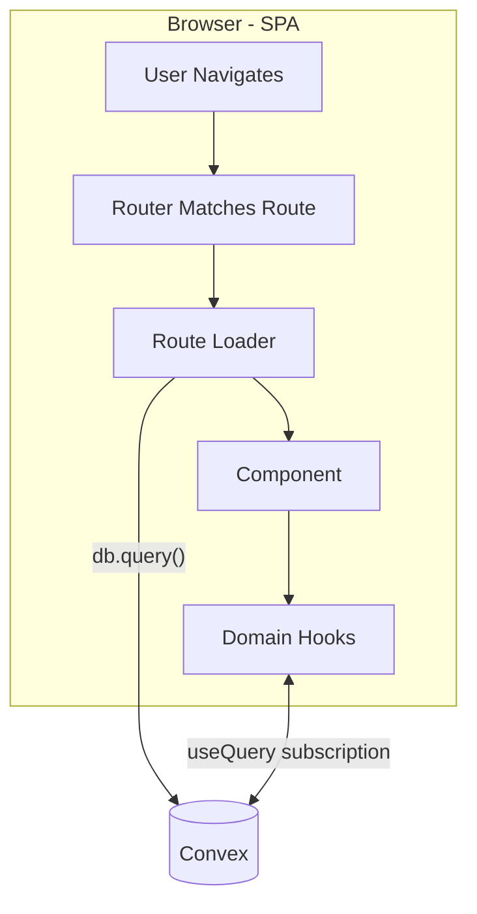

# Architecture

## Request Flow (SPA - all client-side)

Loaders fetch once through `db.query()` for first paint; components then subscribe through domain
hooks, and Convex pushes updates for the life of the screen. There is no client cache — see
[State Management](./state-management.md). The runtime is browser-first SPA, with TanStack Start
prerender used for static output during builds.

## Validation Flow

For mutation inputs, validation happens in three stages:

1. Optional client-side parse (UX feedback only).
2. Convex function boundary validation via `v.*` argument validators.
3. Convex handler semantic validation via shared Zod `safeParse` (authoritative).

This keeps input types strict at the API edge and business rules centralized in shared schemas.

## File-Based Routing

Routes live in `src/app/routes/`. File structure maps to URLs, except that the `_app` segment is a
pathless layout route and is stripped: `_app/index.tsx` → `/`, `_app/auth/login.tsx` →
`/auth/login`. Nearly every visual route lives under `_app`, which supplies the application chrome.
Route tree auto-generates: [`src/app/routeTree.gen.ts`](../src/app/routeTree.gen.ts). Details in
[Routing](./routing.md).

## Path Aliases

Configured in [`tsconfig.json`](../tsconfig.json):

- `@db/core` → `src/app/db/core/index.ts` (DB client, types)
- `@db/*` → `src/app/*/db.ts` (domain hooks)
- `@app/*` → `src/app/*` (app code)
- `@ui/*` → `src/app/ui/*` (every published component)
- `@game/*` → `src/game/*` (print-faithful renderers)
- `@data/*` → `src/data/*` (shared default input values)
- `@sb/*` → `.storybook/*` (Storybook preview, for stories)

## Where components live

Which category a component belongs to is decided by the taxonomy in
[`AGENTS.md`](../AGENTS.md#component-taxonomy), canonically. The architectural facts are these:

- `src/app/ui/**` — **every** published component, filed by category (`block`, `content`, `control`,
  `layout`, `list`, `surface`), imported through the `@ui/*` alias. One rule guards it, in
  [`.oxlintrc.json`](../.oxlintrc.json): a component renders what it is given and does not go and get
  things. No Convex client, no *value* imports from `@db/**` (`import type` is fine and expected), and
  no router data hooks — `Link` stays allowed, `useNavigate` does not.
- `src/app/**` — the application: routes (which own their own page composition), domain data modules
  (`<domain>/db.ts`), the shell (`shell/`), document-rendering glue (`sheet/`, `capture/`), and
  `widgets/<name>` for assemblies two or more routes install whole. There is no `components/`
  directory here — every published component lives in `src/app/ui`.
- `src/game/**` — print-faithful renderers, independent of Mantine and the kit.

## How Things Come Together

### Example: Loading the home page

1. Route [`src/app/routes/_app/index.tsx`](../src/app/routes/_app/index.tsx) — `loader: loadHomepage`
   fetches through `db.query()` before first render.
2. Domain hook [`src/app/homepage/db.ts`](../src/app/homepage/db.ts) — `useHomepage({ initialData:
   loaderData })` subscribes via Convex `useQuery` and keeps the screen live.
3. Database — Convex document database with function-level authorization checks.

See [README](./README.md) for workflows.
