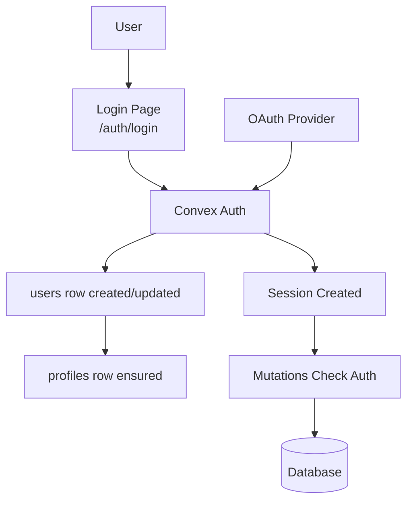

# Authentication

## Auth flow



Convex Auth handles authentication. Domain mutations enforce authorization inside Convex functions.

## Convex Auth

**Client**: [`src/app/db/core/index.ts`](../src/app/db/core/index.ts)

```typescript
export const convex = new ConvexReactClient(import.meta.env.VITE_CONVEX_URL!);
```

## Authentication in mutations

Auth is enforced server-side in Convex mutations:

```typescript
const userId = await requireAuthUserId(ctx);
```

**Examples**: [`convex/members.ts`](../convex/members.ts), [`convex/profiles.ts`](../convex/profiles.ts)

## Auth routes

The visual auth routes live under the `_app` layout, so they carry application chrome; only the
non-visual hand-off sits outside it:

- `_app/auth/login.route.tsx` → `/auth/login` - Login form
- `_app/auth/error.route.tsx` → `/auth/error` - Auth error page
- `_app/auth/index.tsx` → `/auth` - Auth landing
- `auth/oauth.route.tsx` → `/auth/oauth` - Legacy compatibility redirect, outside `_app`

## Profiles

A `profiles` document is created in Convex when an auth user is created or updated: `callbacks.afterUserCreatedOrUpdated` in [`convex/auth.ts`](../convex/auth.ts) calls `ensureProfileForUser` (see [`convex/lib/profileBootstrap.ts`](../convex/lib/profileBootstrap.ts)) using the patched `users` row (`name`, `image`).

If a legacy user has no profile, the client's `useCurrentProfile()` calls `profiles.bootstrapCurrent` once when `profiles.session` returns a `userId` whose `profile` is still `null`. For bulk repair, missing profiles are backfilled by the **`profiles_from_users_v1`** Convex migration (see [`convex/migrations.ts`](../convex/migrations.ts)), which runs with the rest of the widen migrations via `bun run migrations:deploy` / `bun run migrations:dev-strict` and appears on [`/admin/migrations`](../src/app/routes/_app/admin/migrations.route.tsx).

**Hooks**: `useCurrentProfile()`, `useDefaultGroupPreference()`, `useProfileBySlug(slug)`,
`useProfilesAll()`, `useUpdateCurrentProfile()`. Profile lookups are slug-based, never by id.

**Example**: [`src/app/db/profiles.ts`](../src/app/db/profiles.ts)

## Connected sign-in methods and merges

The profile owner manages Google and Discord in the Sign-in methods tab on the profile edit page.
They can connect either provider, or disconnect one while another configured provider remains connected. That last-method check runs in the disconnect transaction. Account
deletion remains on the profile's deletion page.

Connecting starts with an authenticated, unexpired session. The server issues a random connection
credential, stores only its digest, and caps its lifetime at ten minutes and the session's expiration.
After OAuth, a fresh session proves control of the other account. Convex Auth replaces the original
session during this login, so the saved intent carries the first proof. The original account must
still be active. The user reviews the two profiles before confirming the merge, and each intent can
be accepted once. The original profile keeps its name, avatar, address and preferences.

Administrators can choose which profile to keep at `/_admin/accounts`. Both accounts must be active,
and neither may participate in an unfinished merge or ownership transfer from account deletion.
The source account stops accepting writes. Indexed batches transfer credentials, ownership,
memberships and contributions. A failed batch rolls back before the job records failure; an admin
can resume it. The source's sessions are revoked, and its old profile address resolves to the kept
profile. Merges cannot be undone through the product.

Play retains historical actor identities and authorizes them through the kept account's session.
Routing records preserve at most 32 actor identities per game. Account deletion reaches every
retained identity. A merge refuses two occupied seats in the same ongoing game, more than 200
source routing or creation records, and a source game whose provisioning has not finished.

Publication jobs now live at `/_admin/jobs`. The former `/__jobs` address and `/_jobs` redirect there.

### Recover a failed merge

A failed merge remains locked because earlier batches may already have transferred content. There
is no safe cancellation by clearing the locks: overlapping memberships are combined and duplicate
routing rows are removed. Recovery completes the transfer into the chosen profile.

1. Open `/_admin/accounts` with an administrator account. Read the failed job's error, and inspect
   its `account_merge_operations` record in the Convex dashboard. Its `phase` identifies the next
   batch in `MERGE_BATCHES` in `convex/lib/accountMerge.ts`.
2. Inspect the Convex error log for `accounts:advanceBatch` and the named batch. For a deterministic
   code or validation failure, fix its cause and deploy that correction through the normal review
   and CI gates. Preserve the stored phase numbers, profile aliases and game actor identities. Do
   not skip the failing batch, clear account locks or move already-transferred rows back.
3. Select **Retry merge** in Accounts. Each batch drains the remaining indexed source rows, so
   completed batches stay completed and a partially completed phase continues with its remaining
   rows. The failed batch's transaction has rolled back before the failure was recorded.
4. Wait for **Completed**, then verify both sign-in accounts reach the kept profile, the old profile
   address redirects, and the transferred content appears. Completion revokes source sessions and
   removes the account-management locks. If the same error recurs, retain the lock and return to
   step 2 rather than repeatedly retrying the same deterministic failure.

The kept account stays active while recovery is pending; its existing sign-in method and ordinary
content access remain available. An administrator who is merging their own profile retains admin
access on the kept account and can sign in with that account's existing method to resume the job.
