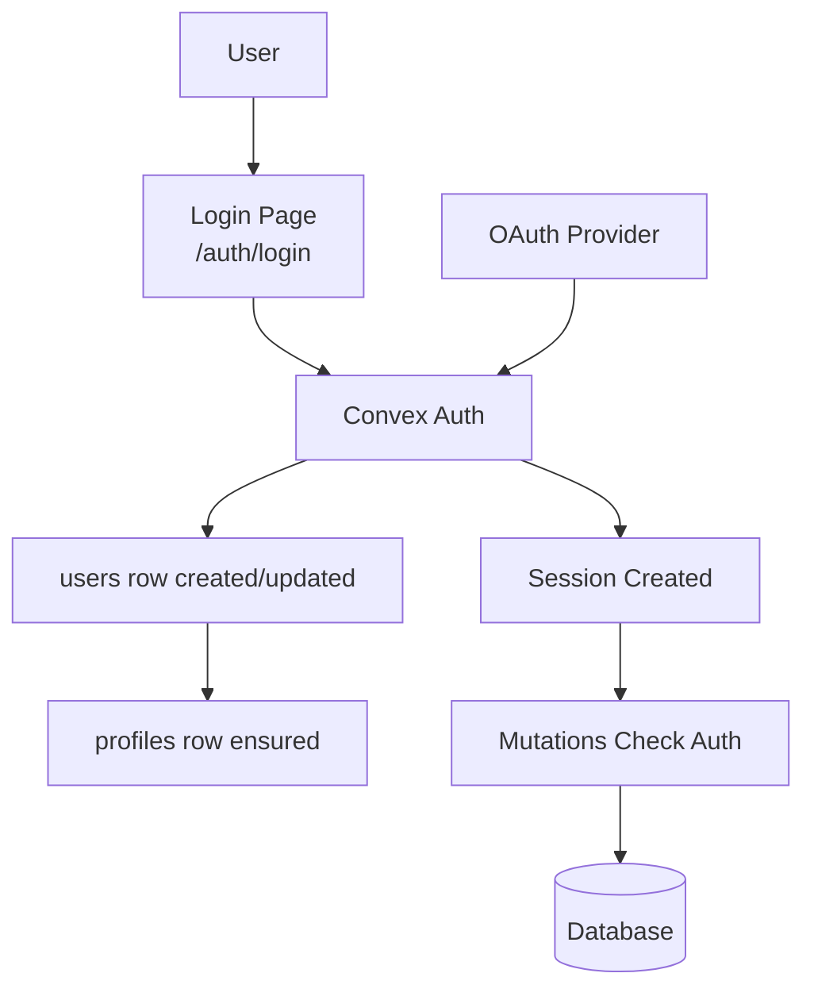

# Authentication

## Auth flow



Convex Auth handles authentication. Domain mutations enforce authorization inside Convex functions.

Stored sessions are checked alongside the signed identity. Revoked sessions cannot read owner-only
data or start account deletion. Mutations reject both absolute and idle session expiry immediately.
Each new session receives a scheduled expiry job, and a one-time migration registers existing
sessions. The job rechecks refreshed deadlines and removes expired sessions and refresh credentials
in bounded batches. There is no recurring authentication poll. Queries never read the clock and
lose private access when the job removes the session. A delayed job can therefore allow new private
reads until removal; mutations and Play enforce their deadlines independently. An unexpired JWT
retains ordinary account access when its refresh branch has been invalidated, until session cleanup
or JWT expiry. Play requires an unused refresh token.

Disconnecting a provider revokes every existing session for the account. A revocation checkpoint
blocks private reads, writes and token refresh before asynchronous cleanup finishes. A later sign-in
with a remaining provider creates a usable session. The profile edit page clears its local tokens
after disconnection.

## Convex Auth

**Client**: [`src/app/db/core/index.ts`](../src/app/db/core/index.ts)

```typescript
export const convex = new ConvexReactClient(import.meta.env.VITE_CONVEX_URL!);
```

## Authentication in mutations

Auth is enforced server-side in Convex mutations:

```typescript
const userId = await requireAuthUserId(ctx);
```

**Examples**: [`convex/members.ts`](../convex/members.ts), [`convex/profiles.ts`](../convex/profiles.ts)

## Auth routes

The visual auth routes live under the `_app` layout, so they carry application chrome; only the
non-visual hand-off sits outside it:

- `_app/auth/login.route.tsx` → `/auth/login` - Login form
- `_app/auth/error.route.tsx` → `/auth/error` - Auth error page
- `_app/auth/index.tsx` → `/auth` - Auth landing
- `auth/oauth.route.tsx` → `/auth/oauth` - Legacy compatibility redirect, outside `_app`

## Profiles

A `profiles` document is created in Convex when an auth user is created or updated: `callbacks.afterUserCreatedOrUpdated` in [`convex/auth.ts`](../convex/auth.ts) calls `ensureProfileForUser` (see [`convex/lib/profileBootstrap.ts`](../convex/lib/profileBootstrap.ts)) using the patched `users` row (`name`, `image`).

If a legacy user has no profile, the client's `useCurrentProfile()` calls `profiles.bootstrapCurrent` once when `profiles.session` returns a `userId` whose `profile` is still `null`. For bulk repair, missing profiles are backfilled by the **`profiles_from_users_v1`** Convex migration (see [`convex/migrations.ts`](../convex/migrations.ts)), which runs with the rest of the widen migrations via `bun run migrations:deploy` / `bun run migrations:dev-strict` and appears on [`/admin/migrations`](../src/app/routes/_app/admin/migrations.route.tsx).

**Hooks**: `useCurrentProfile()`, `useDefaultGroupPreference()`, `useProfileBySlug(slug)`,
`useProfilesAll()`, `useUpdateCurrentProfile()`. Profile lookups are slug-based, never by id.

**Example**: [`src/app/db/profiles.ts`](../src/app/db/profiles.ts)

## Connected sign-in methods and merges

A profile may also have a public BoardGameGeek profile link, edited in the Profile tab and saved
with the rest of the draft. Its ownership is unverified. It cannot sign anyone in, satisfy the
last-method guard or authorize a profile merge. Clearing the URL and saving removes the link.
Only HTTPS BoardGameGeek user-profile URLs are accepted; saves remove query strings and fragments.
The kept profile retains its own link during a merge.

The profile owner manages Google, Discord and Reddit in the Sign-in methods tab on the profile edit page.
They can connect an available provider, or disconnect one while another configured provider remains connected. Disconnection uses the kit's hold-to-remove action. The last-method check runs in the disconnect transaction. Disconnecting signs the account out on every device. Account
deletion remains on the profile's deletion page.

Connecting starts with an authenticated, unexpired session. The server issues a random connection
credential, stores only its digest, and caps its lifetime at ten minutes and the session's expiration.
After OAuth, a fresh session proves control of the other account. Convex Auth replaces the original
session during this login, so the saved intent carries the first proof. The original account must
still be active. The user reviews the two profiles before confirming the merge, and each intent can
be accepted once. Its progress credential expires at the same ten-minute deadline, including after
a completed or failed merge. The deployment backfill expires older accepted credentials whose
deadlines have already passed. Failure details stay in the administrator view. The original profile keeps its name, avatar, address and preferences.

Administrators can choose which profile to keep at `/_admin/accounts`. Both accounts must be active,
and neither may participate in an unfinished merge or ownership transfer from account deletion.
The source account stops accepting writes. Indexed batches transfer credentials, ownership,
memberships and contributions. A failed batch rolls back before the job records failure; an admin
can resume it. The source's sessions are revoked, and its old profile address resolves to the kept
profile. Merges cannot be undone through the product.

Play retains historical actor identities and authorizes them through the kept account's session.
Routing records preserve at most 32 actor identities per game. Account deletion reaches every
retained identity. A merge refuses two occupied seats in the same ongoing game, more than 200
source routing or creation records, and a source game whose provisioning has not finished.

Publication jobs now live at `/_admin/jobs`. The former `/__jobs` address and `/_jobs` redirect there.

### Recover a failed merge

A failed merge remains locked because earlier batches may already have transferred content. There
is no safe cancellation by clearing the locks: overlapping memberships are combined and duplicate
routing rows are removed. Recovery completes the transfer into the chosen profile.

1. Open `/_admin/accounts` with an administrator account. Read the failed job's error, and inspect
   its `account_merge_operations` record in the Convex dashboard. Its `phase` identifies the next
   batch in `MERGE_BATCHES` in `convex/lib/accountMerge.ts`.
2. Inspect the Convex error log for `accounts:advanceBatch` and the named batch. For a deterministic
   code or validation failure, fix its cause and deploy that correction through the normal review
   and CI gates. Preserve the stored phase numbers, profile aliases and game actor identities. Do
   not skip the failing batch, clear account locks or move already-transferred rows back.
3. Select **Retry merge** in Accounts. Each batch drains the remaining indexed source rows, so
   completed batches stay completed and a partially completed phase continues with its remaining
   rows. The failed batch's transaction has rolled back before the failure was recorded.
4. Wait for **Completed**, then verify both sign-in accounts reach the kept profile, the old profile
   address redirects, and the transferred content appears. Completion revokes source sessions and
   removes the account-management locks. If the same error recurs, retain the lock and return to
   step 2 rather than repeatedly retrying the same deterministic failure.

The kept account stays active while recovery is pending; its existing sign-in method and ordinary
content access remain available. An administrator who is merging their own profile retains admin
access on the kept account and can sign in with that account's existing method to resume the job.


## Reddit sign-in

Reddit uses the existing Convex Auth OAuth flow and account connection rules. It requests only
`identity` with temporary access, maps the stable Reddit user ID and username, and does not request
email, posts, messages or a refresh token. Reddit becomes available only when all three deployment
variables exist: `AUTH_REDDIT_ID`, `AUTH_REDDIT_SECRET`, and `AUTH_REDDIT_USER_AGENT`.
The sign-in page reads public provider availability; profile settings use their existing owner-only
query. Both pages leave unconfigured providers disabled.

Reddit currently requires explicit approval before API access. For this external website sign-in
use case, use the developer access request linked from its
[Responsible Builder Policy](https://support.reddithelp.com/hc/en-us/articles/42728983564564-Responsible-Builder-Policy).
The app name is `dune.zone`, owned by the Reddit account `bad-advice-generator`. The request should describe voluntary identity-only login
and linking, and disclose that users can combine their own Dune Zone profiles after authenticating
both accounts. It should not request subreddit content access.

After approval, register a web application for `https://dune.zone` with this exact production callback:

```text
https://exuberant-finch-263.eu-west-1.convex.site/api/auth/callback/reddit
```

The callback host comes from the production Convex HTTP deployment configured in
`workers/publisher/wrangler.jsonc`. Convex handles the provider callback before returning the user
to Dune Zone. The app's `/auth/callback` route is not the URL to register with Reddit.
Reddit supports only one callback per client ID, so another deployment needs separate credentials.

Configure the approved client ID and secret in the production Convex deployment, and set
`AUTH_REDDIT_USER_AGENT` to `web:dune-zone:v1 (by /u/bad-advice-generator)`.
Keep credentials out of browser environment variables, source files and issue comments.
Then verify real Reddit login, linking, reconnecting and the last-method guard with dedicated test
accounts. Mocked callback tests establish local behavior; they do not establish Reddit approval or
successful live access.
