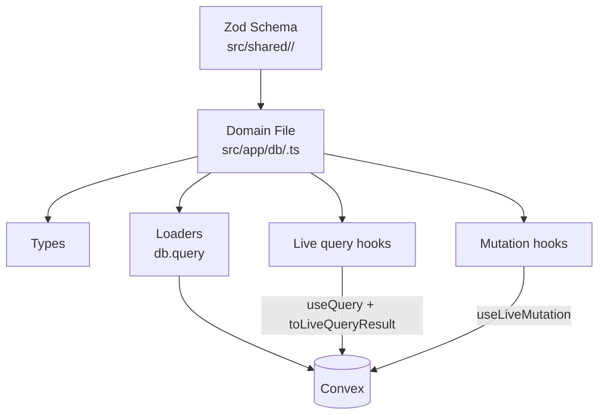

# Data Layer

## Domain File Structure



Each domain file follows this structure: types → loaders → live query hooks → mutation hooks. There
are no query keys and no cache; see [State Management](./state-management.md).

## The only doorway to Convex

`src/app/db` is the only place in `src/**` that may import Convex — the generated API, the types
under `convex/lib`, or the `convex` package. A domain module re-exports the Convex shapes the rest
of the application needs, so a second import path never opens:

```typescript
export type { AssignedGroupSummary, MembershipState }; // src/app/db/groups.ts
```

Enforced by `no-restricted-imports` for all of `src/**` except `src/app/db/**`. See the Convex
doorway section in [`AGENTS.md`](../AGENTS.md) for why a second doorway costs type precision.

## Convex Schema

Convex schema and indexes are defined in [`convex/schema.ts`](../convex/schema.ts). Domain-level Zod
schemas live in `src/shared/<domain>/` — the validators in `validation.ts`, and the faction
contract in [`src/shared/factions/schema.ts`](../src/shared/factions/schema.ts) with its generated
asset-id vocabulary in [`src/shared/assetIds.ts`](../src/shared/assetIds.ts). They sit in `src/shared`
because both the app and the Convex server parse against them.

## Basic DB Structure

**Tables**: `users`, `counters`, `profiles`, `groups`, `group_members`, `factions`, `assets`,
`asset_relations`, `publication_assets`, `publication_jobs`, `admin_settings`, `rulesets`,
`migration_runs`, `ruleset_asset_slots`, `ruleset_factions`, `faq_items`, `faq_answers`, plus the
Convex Auth tables.

**Pattern**: Domain data is stored in Convex documents, validated with function validators at the
boundary and shared Zod schemas inside the handler. Factions, rulesets, groups, and community Assets
use soft delete.

## Domain File Pattern

### 1. Types

Wrap Convex document types with domain types:

```typescript
export type FactionRow = Doc<'factions'>;
export type FactionEntry = Omit<FactionRow, 'data'> & {
  data: FactionData; // Validated Zod type
};
```

### 2. Loaders and hooks

A loader reads once for first paint; the hook subscribes and takes the loader's result as
`initialData`:

```typescript
export async function loadFactionCataloguePage(): Promise<FactionCataloguePageData> {
  const raw = await db.query(api.factions.cataloguePage, {});
  return toFactionCataloguePageData(raw);
}

export function useFactionCataloguePage(options?: { initialData?: FactionCataloguePageData }) {
  const liveData = useQuery(api.factions.cataloguePage, {});
  const normalized = liveData ? toFactionCataloguePageData(liveData) : undefined;
  return toLiveQueryResult(normalized, true, () => options?.initialData);
}
```

**Example**: [`src/app/db/factions.ts`](../src/app/db/factions.ts)

## Data Validation

Shared domain Zod schemas in `src/shared/<domain>/validation.ts` validate at runtime:

- Before database operations (mutations)
- After database reads (queries)
- Type inference: `type Faction = z.infer<typeof schema>`

**Example**: [`src/shared/factions/schema.ts`](../src/shared/factions/schema.ts)

## Validation Standard

Use a two-layer validation model for all mutations:

1. **Boundary validation (Convex `v`)** for argument shape/type.
2. **Semantic validation (shared Zod)** for business rules.

Both client and server should parse the same Zod schema, but server parsing is authoritative.
Client parsing is for UX only and must not be treated as security.

### Enforcement Order

1. Normalize raw inputs (trim, map optional fields, etc.).
2. Run `safeParse` using shared Zod schema.
3. On parse failure, map issues to a stable, user-facing error message.
4. Continue mutation logic only with parsed data.

### Convex Mutation Pattern

```typescript
export const updateSomething = mutation({
  args: {
    name: v.string(),
  },
  handler: async (ctx, args) => {
    const parsed = someSharedSchema.safeParse({
      name: args.name,
    });
    if (!parsed.success) {
      const msg = parsed.error.issues.map((i) => i.message).join(' ');
      throw new Error(msg || 'Invalid input');
    }

    const input = parsed.data;
    // mutation logic using validated `input`
  },
});
```

### Adoption Checklist

- Find duplicated manual checks in Convex handlers.
- Move those rules into shared Zod schemas.
- Parse the same schema in client and server.
- Keep Convex `v` validators at function boundaries.
- Keep validation error messages stable and user-friendly.

### Current Exemplars

- Shared profile semantic schema: [`src/shared/profiles/validation.ts`](../src/shared/profiles/validation.ts)
- Server-authoritative parse in mutation: [`convex/profiles.ts`](../convex/profiles.ts)

## Soft Delete Pattern

Factions, rulesets, groups, and community Assets use `is_deleted` flags instead of hard deletes:

- Queries filter deleted rows in Convex query handlers
- Delete mutation sets `is_deleted: true`
- Deleting a group never cascades: memberships and asset `group_id` associations survive
- A group reference that does not resolve to a live group (soft-deleted, or a dangling id from
  historical hard deletions) is projected to `null` inside the Convex layer
  (`liveGroupOrNull` in [`convex/lib/collaborativeAccess.ts`](../convex/lib/collaborativeAccess.ts)),
  so clients never see a deleted group or a dangling reference
- Deleting an Asset never cascades either: `asset_relations` rows survive, so a deleted card simply
  stops appearing in the decks that reference it, filtered at query level
- Deleted names and slugs stay reserved (see ADR-0003)

**Example**: [`src/app/db/factions.ts`](../src/app/db/factions.ts)

## Convex `useQuery` in domain hooks (`src/app/db/*.ts`)

Avoid Convex React `"skip"` and `enabled ? args : 'skip'` in domain data modules. When a subscription should not run, **unmount** the component that calls `useQuery` (for example, render a child only when `open && userId`, or split route shells so live-only paths do not mount DB-mode hooks). Route loaders continue to prefetch with `db.query`; route leaves use matching `useQuery` with the same arguments and `initialData` from the loader where applicable.

**Guard**: `bun run check:convex-skip` fails if `skip` appears as a quoted string — single, double or backtick — anywhere under `src/app/db/**/*.ts`, `core/` included.
