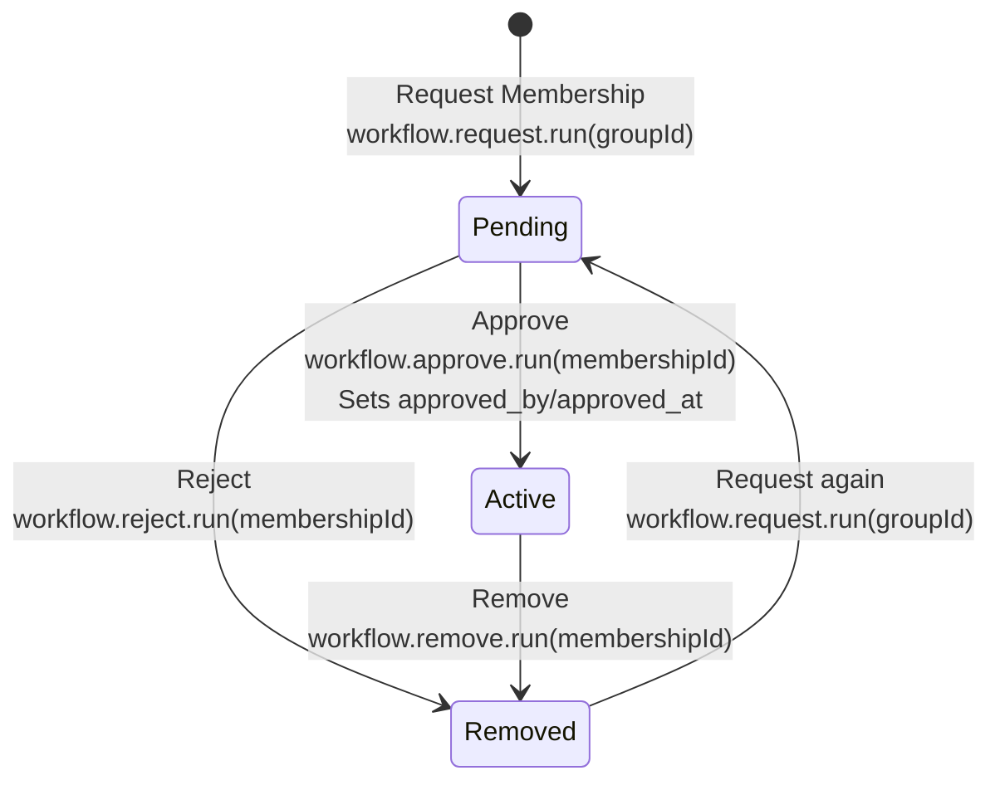

# Membership

## Approval Flow

Status transitions: requests create `pending` memberships, approval moves `pending` → `active`, and
rejection or removal moves a membership to `removed`. Calling `members.request` for a removed
membership reactivates it as `pending`.

## Status Enum

**Type**: an inline Convex literal union on the `group_members` table
([`convex/schema.ts`](../convex/schema.ts)), mirrored client-side in
[`src/app/db/members.ts`](../src/app/db/members.ts)

- `pending` - Membership requested, awaiting approval
- `active` - Approved, active member
- `removed` - Rejected or removed

## Viewer access projection

Page queries hand each detail route a `viewerAccess` already narrowed to that page's kind —
`Extract<CollaborativeAccess, { kind: 'faction' }>` and so on
([`src/app/db/factions.ts`](../src/app/db/factions.ts),
[`groups.ts`](../src/app/db/groups.ts), [`rulesets.ts`](../src/app/db/rulesets.ts)). Routes read
`viewerAccess.capabilities.*` directly. There is deliberately no client-side projection helper
between the two: one existed, took the *wide* union, and re-narrowed at runtime what every caller
already knew statically.

Three properties of the wire shape are worth knowing before writing defensive code against it:

- **`viewer.membership` has three states, not four.** `'removed'` is server-internal: it lives on
  the stored `group_members` row and on `ViewerFacts`, and `evaluateCollaborativeAccess` collapses
  it to `'none'` before projecting ([`convex/lib/collaborativeAccess.ts`](../convex/lib/collaborativeAccess.ts)).
  A removed member is indistinguishable from a stranger to the client, which is what lets them
  request membership again. So `Record<MembershipState, …>` over the viewer's status is exhaustive
  with three keys.
- **Every capability is a non-optional boolean.** The validators declare `v.boolean()`, so
  `capabilities.edit ?? false` is dead code — read the field.
- **A group-kind access has no `edit`, `changeGroup` or `assignedGroup`.** Those are asset-only, and
  the per-kind narrowing means the compiler enforces it rather than a runtime `kind` check.

### Group assignment affordances

For an asset, `group.eligible` is `assignedGroup !== null`, and a soft-deleted or dangling group
reference projects to `assignedGroup: null` while the row's own `group_id` stays set. The client
rule follows from that pair, not from `assignedGroup` alone:

- **Offer assignment** only when the row carries no assignment at all — `changeGroup && group_id == null`.
- **Keep removal available** whenever the row is assigned, including when the group no longer
  resolves — `changeGroup && group_id != null`.

The dangling case is the one that matters: the owner sees **Remove from group**, never **Assign to
group**, because assigning is the wrong repair for a reference that already exists. Server-side
coverage is in [`convex/groups.softDeletion.test.ts`](../convex/groups.softDeletion.test.ts); the
client branch is two expressions in
[`rulesets/$rulesetSlug/index.tsx`](../src/app/routes/_app/rulesets/$rulesetSlug/index.tsx) and is
recorded here because inlining the projection removed the unit test that used to state it.

## Approval Metadata

`approved_by` and `approved_at` are set in Convex membership mutations when status becomes `active`.

## Client workflow

`useGroupMembershipWorkflow` exposes the named `request`, `approve`, `reject`, `remove`, and `add`
commands with normalized pending and error state. Group detail consumes the canonical Group page
projection: `viewerAccess` controls viewer actions, while each `roster` row controls approve, reject,
and remove actions. Callers pass `membershipId` for moderation and never reconstruct authorization
from raw membership rows.

Asset page queries provide server-derived `assignableGroups`; assignment controls do not query or
filter raw membership rows.

**Example**: [`src/app/db/members.ts`](../src/app/db/members.ts)

## Authorization

Convex handlers in `convex/members.ts` enforce authorization through the trusted collaborative-access
module:

- **`approveRequest` / `rejectRequest`**: Caller must be an **active** member of the Group. Target row must be **`pending`**.
- **`removeMember`**: Only the **Group owner** may remove someone else. The owner cannot be removed. Target must be **`active`** (pending requests are handled with `rejectRequest`).
- **`request`**: Any authenticated user may request membership.
- **`addMember`**: Any active member may directly add another user without a prior request.

Only the canonical membership transport is public: `request({ group_id })`, the membership-ID
moderation commands, and `addMember({ groupId, userId })`. Page queries expose purpose-built
`viewerAccess`, `roster`, `assignableGroups`, and `groupSummaries` projections rather than raw
membership rows.

The transport was widened before every application caller moved to that contract. The narrowing
release may deploy only while the canonical Worker cutover commit
`3a67eb6f523f0d15811d9725e9a63c11ad47c1d8` or a descendant is live. Once Convex is narrowed, a
rollback to an older Worker requires Convex to be re-widened first.

## Group-associated content

Groups are collaboration boundaries shared by factions, rulesets, and future community assets.

- Only the group owner may rename the group.
- Active members may edit content associated with their group.
- Only the asset owner may delete it or assign, unassign, or move it between groups.
- Active members may rename factions.
- Only the ruleset owner may rename a ruleset.
- Active members may add or remove factions from a ruleset without deleting either asset.

## FAQ ownership and moderation

- A question author may edit or delete their question and accept or unaccept its answers, regardless
  of the ruleset's group membership.
- An answer author may edit or delete their own answer.
- The question author may delete answers on their question, but may not edit another author's text.
