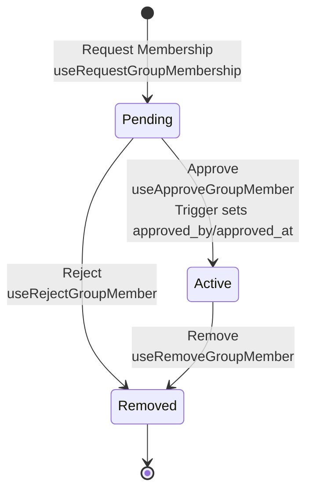

# Membership

## Approval Flow

Status transitions: `pending` → `active` (approved) or `removed` (rejected/removed).

## Status Enum

**Type**: `group_member_status` enum

- `pending` - Membership requested, awaiting approval
- `active` - Approved, active member
- `removed` - Rejected or removed

## Approval Metadata

`approved_by` and `approved_at` are set in Convex membership mutations when status becomes `active`.

## Hooks

**Mutations**: `useRequestGroupMembership`, `useApproveGroupMember`, `useRejectGroupMember`, `useRemoveGroupMember`

**Queries**: `useGroupMembers`, `useGroupMembersByStatus`, `useGroupMember`, `useUserGroupMemberships` (mount only when `userId` is known), `useUserGroupMembershipGroups` (helper over membership rows)

**Example**: [`src/app/members/db.ts`](../src/app/members/db.ts)

## Authorization

Convex handlers in `convex/members.ts` enforce:

- **`approve` / `reject`**: Caller must be an **active** member of the group (`isActiveGroupMember`). Target row must be **`pending`**.
- **`remove`**: Only the **group creator** (`groups.created_by`) may remove someone else. Cannot remove the creator. Target must be **`active`** (pending requests are handled with `reject`).
- **`request`**: Any authenticated user may request membership.
- **`add`**: Any active member may directly add another user without a prior request.

Shared helpers live in `convex/lib/policy.ts` (`requireAuthUserId`, `isActiveGroupMember`).

## Group-associated content

Groups are collaboration boundaries shared by factions, rulesets, and future community assets.

- Active members may edit content associated with their group.
- Only the asset owner may delete it or assign, unassign, or move it between groups.
- Active members may rename factions.
- Only the ruleset owner may rename a ruleset.
- Active members may add or remove factions from a ruleset without deleting either asset.

## FAQ ownership and moderation

- A question author may edit or delete their question and accept or unaccept its answers, regardless
  of the ruleset's group membership.
- An answer author may edit or delete their own answer.
- The question author may delete answers on their question, but may not edit another author's text.
