# Play-first homepage comparison

Throwaway visual work for [Choose the Play-first homepage composition and visual direction](https://github.com/ndelangen/dunezone/issues/1817). Norbert has not selected a direction. This branch is review material, not production implementation.

[Latest comparison: E, F and G](ROUND_TWO.md) builds on D with board-only captures, larger artwork clouds and new examples.

## Run

From this checkout, with the normal app dependencies and generated images available:

```sh
APP_DEV_PORT=3014 bun run app:dev
```

The app uses its configured integration deployment for reads. The prototype adds no mutations. This local checkout has only the public `VITE_CONVEX_URL` setting copied into its ignored `.env.local`; it contains no deployment credentials.

Open these versions of the existing homepage:

- [A: The big reveal](http://localhost:3014/?variant=A). A wide Play still leads, followed by separate editorial sections for Rulebooks, factions and Assets.
- [B: The makers gallery](http://localhost:3014/?variant=B). Play image and introduction share a row. A compact gallery brings the different creations together before the creation invitations.
- [C: Your next move](http://localhost:3014/?variant=C). A short Play introduction leads into numbered chapters, with each creation action beside its example.

The floating bar and left/right arrow keys switch versions. Search parameters survive reload. Switching clears the previous section anchor. Keyboard cycling ignores text fields. With no variant parameter, the original homepage renders. The comparison is gated to development builds.

## Earlier comparison

The initial recommendation was B. Norbert asked for a clearer coming-soon announcement, more space, one concept at a time, larger media and playful animation. Version D responds to that feedback. No direction has been accepted yet.

B makes the range of creations visible sooner while keeping Play first. A gives the gameplay image the most attention, at the cost of a longer introduction. C explains the creation process most directly, but the numbered steps can suggest an order that visitors do not have to follow. The user can choose a version or combine parts after review.

## Content and ownership

The route owns the seven compositions and its switcher. All prototype functions are local to `src/app/routes/_app/index.tsx`, with page-specific composition in the adjacent stylesheet. The existing homepage loader and subscription remain intact. PageLayout, PageTitle, Section, Surface, PublishedImage and AssetFace provide the existing frame, headings, pane and artwork behavior. No new kit vocabulary or backend contract is proposed by this prototype.

The shared chrome, navigation and footer are unchanged. Both signed-in and signed-out readers receive the same editorial page. Creation links use the existing routes; a signed-out browser was checked through Create a faction and reached the existing login gate. Other creation paths retain the same route contracts and were inspected in source.

Play stays coming soon. Its action scrolls to the promotional still. There is no beta link or imported Play runtime. The still is a real capture of the public Storybook Journey, Spice Blow, a recorded development scenario. It is labelled as a development preview. The small J36 marker belongs to that source; a final promotional capture should remove the Storybook journey marker through its presentation controls or a deliberate crop.

The Rulebook crops show the saved five-page Arrakis field guide demonstration created for this map, not a published complete rules release. They have no destination link. Discord Legends and Space Orks are captures of the public faction pages, and the deck and token use existing published images with their normal physical outlines. The faction captures retain page background and clip the far edge of a leader row. The production design should select individual component previews once the desired layout is accepted.

Maintainer credits accompany real examples. Dreamrules is linked as a Ruleset and Group example, with no claim that it has a Rulebook. The recent section is a labelled fixed sample for layout review; its automatic selection and exclusions remain implementation work under the approved content decision. Examples are replaceable, and additional bespoke content is not required before shipping the redesign.

## Loading and motion

Play uses a still with fixed dimensions and high fetch priority. Rulebook and faction images use PublishedImage, and Assets use AssetFace, which owns their shape and PublishedImage arrival. These reserve their space and retain existing loading, failure and reduced-motion behavior. No video downloads or autoplay occur. Static book tilts remain under reduced motion. The browser was observed with PublishedImage's reduced-motion state active and all seven images decoded.

For production, use a properly sized compressed Play still and responsive media sizes. Keep below-fold artwork lazy, preserve aspect ratios, and use the accepted missing-preview policy. A film is optional future work, not necessary to evaluate or implement these compositions.

## Verification and limits

- Typecheck passed. This throwaway comparison has no new automated tests.
- Desktop review at 1280 by 720 and phone review at 390 by 844. Each version has one page heading and no horizontal page overflow at the phone width.
- Switcher buttons, section anchors, and the signed-out faction creation path were exercised in the browser.
- All seven example images decoded in the settled page. Captures must wait for the shared image arrival to finish.
- Desktop proof includes complete pages. Mobile proof uses visible viewport captures because the browser's full-page capture paints the fixed background only in the current viewport, leaving black regions elsewhere. Those full-page mobile captures were discarded.
- The existing fixed background becomes dark near the bottom of a phone viewport, reducing contrast for dim copy. The chosen composition needs a readability pass during implementation within the existing shell constraints.
- The recent selection, live identity lookup and stale-content fallbacks are not implemented here. No publisher verification, PR, merge or deployment was performed for this throwaway branch.

## Proof

The desktop captures preserve the real application frame; the mobile captures show each composition's creation section. The mobile opening and signed-out gate are included separately.

| A | B | C |
| --- | --- | --- |
| 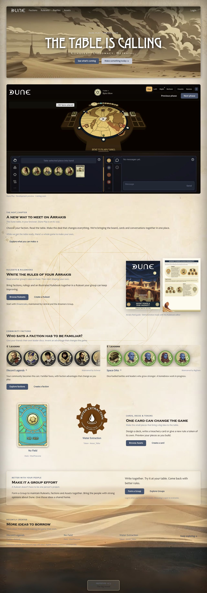 | 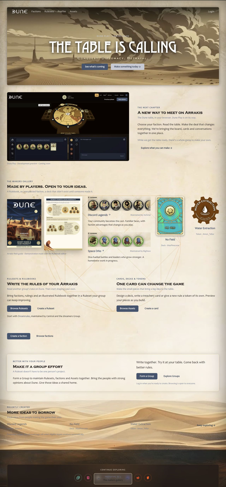 | 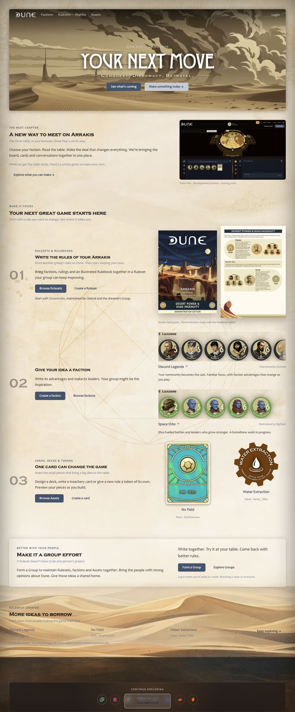 |
| 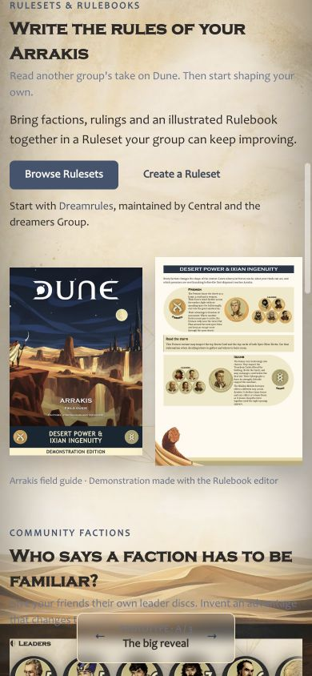 | 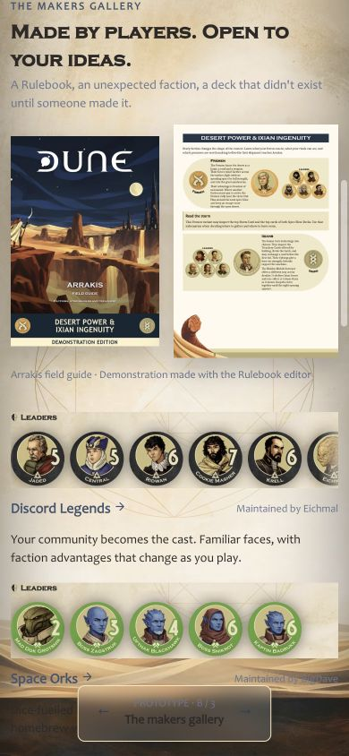 | 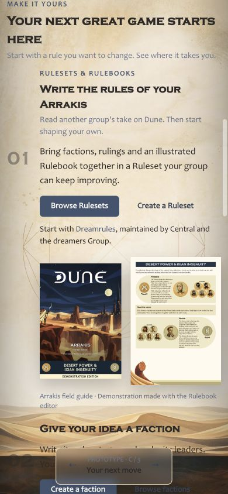 |

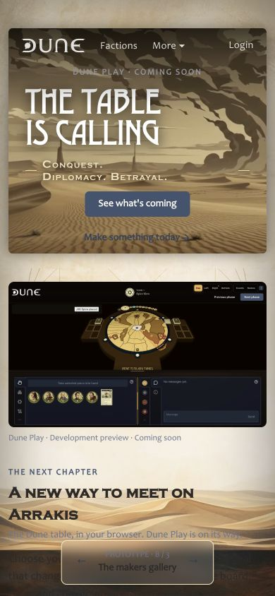

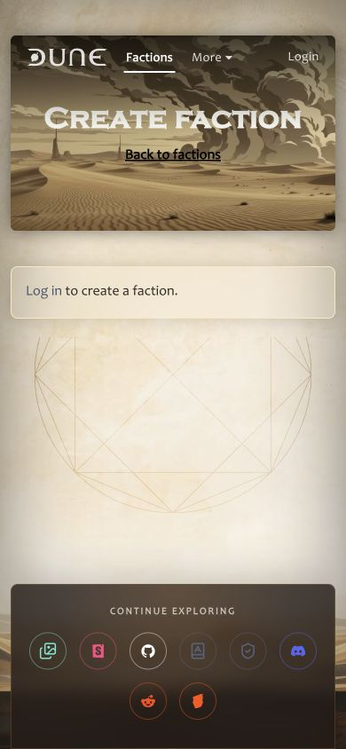

[Original homepage baseline](proof/baseline.jpg).


## Revision D

[Open D: Coming soon. Make it yours.](http://localhost:3014/?variant=D)

The opening now says "Dune Play is coming soon". The sneak peek leads to the development still, followed by an explicit notice that Play is not available yet. No secret route or release date appears.

Each following section gives one idea room: Rulebooks, homebrew leader portraits, new troop vectors, cards and tokens, existing community factions, then collaboration. Rulebook pages and cardbacks overlap into fans. Four portraits from the current media library appear at large scale. Five troop silhouettes get a separate section. The collaboration section uses illustrative leader discs, labelled as examples made with the artwork library.

The artwork arrives on scroll. Fans unfold over one second with staggered starts, portraits spread out, and troops move into position. Hover lifts individual pieces. These are finite entrances, with no looping animation. Reduced motion disables entrances and hover movement while retaining static overlaps and tilts. Original artwork files are unchanged.

Verified at 1280 by 720 and 390 by 844: one main heading, no horizontal page overflow, working creation-section anchor, all 19 HTML images decoded after scrolling the page. All seven section entrances were triggered. Normal-motion styles select the fan animation; reduced-motion styles select none and retain the final transforms. Temporary browser overrides were reset. Typecheck and focused lint passed.

The existing shell background still changes contrast near the bottom of the viewport, most visibly in the recent examples. That remains a production readability concern. The recent section remains a fixed labelled sample. D is a prototype for design review, not a deployed homepage.

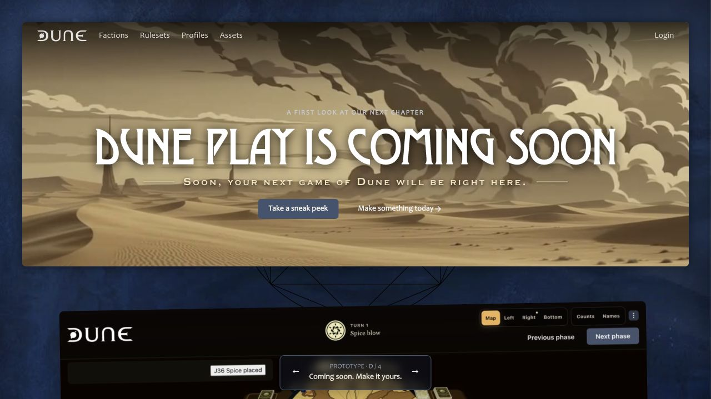
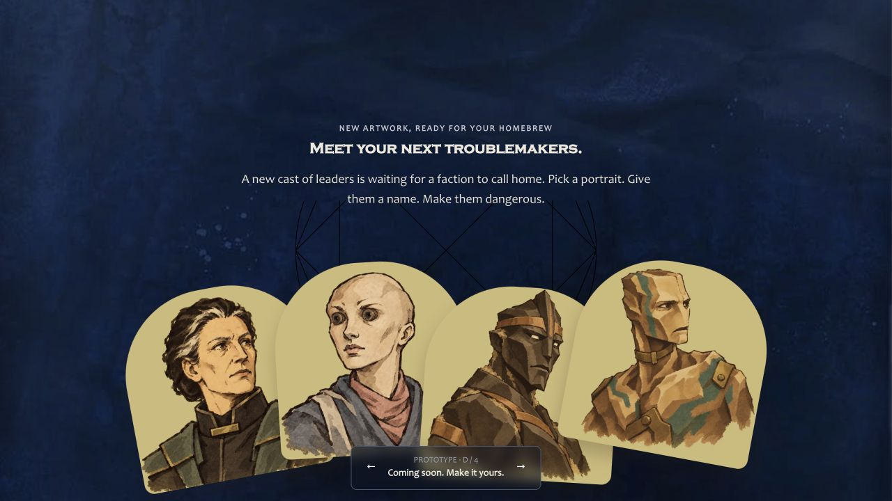
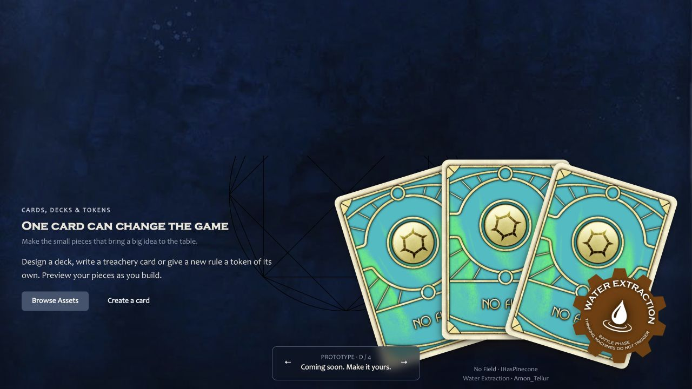
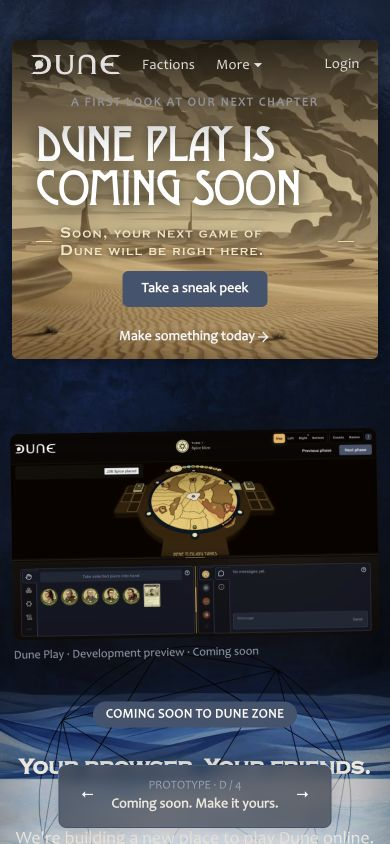
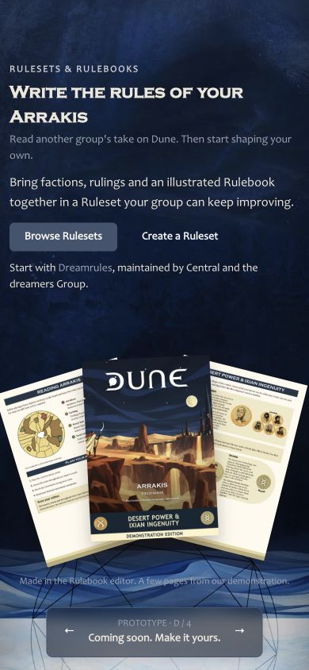

[Complete D desktop capture](proof/D-desktop.png).
