# Three designs inspired by D

Review material for [Choose the Play-first homepage composition and visual direction](https://github.com/ndelangen/dunezone/issues/1817). Norbert prefers E and requested the refinement below. The revised design remains a throwaway prototype for review.

| Design | Composition |
| --- | --- |
| [E: The grand reveal](http://localhost:3014/?variant=E) | A wide board reveal, centered chapters and large artwork clouds. Closest to D. |
| [F: The field journal](http://localhost:3014/?variant=F) | Offset images, an overlapping board close-up, alternating text and artwork, and individually spread cards. |
| [G: Worlds within worlds](http://localhost:3014/?variant=G) | Circular board crops and two messy wings of artwork around the copy. |

The floating switcher and left/right arrow keys cycle through these three designs. A through D remain available at their original URLs. The normal homepage is unchanged without a development-only variant parameter.

## Shared changes

The heading says "Dune Play is coming soon". The preview explains that Play is not available yet. No release date or secret route appears.

The Rulebook invitation explicitly describes online reading and reference, plus PDF downloads. Its three-page fan uses the existing demonstration Rulebook, without implying a published complete rules release.

The leader cloud contains 28 distinct homebrew portraits, all circular, with varied sizes and overlaps. The troop cloud contains 26 distinct designs from the new vector collection. Both use existing media, and source artwork files are unchanged.

Three different published card faces replace the repeated No Field backs. Credits sit outside the tilted artwork so they remain readable:

- [Supplies!](https://dune.zone/assets/card-treachery/supplies), maintained by Central.
- [Trishula!](https://dune.zone/assets/card-treachery/trishula), maintained by Central.
- [Arrakeen](https://dune.zone/assets/card-treachery/arrakeen), maintained by IHasPinecone.

The community section renders individual Space Orks leader discs against the page background. It replaces the rectangular faction screenshots and retains the faction's work-in-progress label and BigDave credit.

"Some alliances are worth keeping" introduces Groups. A custom alliance card invites readers to pool ideas and build Rulesets, factions and Assets together. It uses the existing AllianceCard renderer and is labelled as an invitation example. It is not a saved or published community Asset.

Scroll entrances and hover movement are finite. Reduced motion disables movement while preserving the final fans and circle positions.

## Board capture

The prototype branch incorporates main at `592554aedc9`, including the current faction-token placement and board presentation. The board images come from the local `Pages/Play/Playing` story, `Opens Still`, using the current `playingSnapshot()` development fixture. All six faction tokens remain on the table.

- [Wide board](../../../public/homepage-prototype/board-wide.jpg): 3000 by 1420 pixels.
- [Board detail](../../../public/homepage-prototype/board-detail.jpg): 1600 by 1000 pixels.

Both captures exclude the Play controls and Storybook furniture. The detail uses the board's focus view. These are development demonstrations, not evidence of a community match. F and G include the close-up.

## Verification and remaining work

Typecheck, focused lint and the whitespace check passed. Desktop review used 1280 by 720; phone review used 390 by 844. All three designs fit without horizontal page overflow. All HTML images loaded after scrolling each complete desktop page. Switcher buttons, keyboard wraparound and section anchors worked.

The portrait cloud was also checked in light mode. The community discs and alliance card were inspected in dark mode. Normal-motion entrances and reduced-motion behavior were checked, and temporary browser overrides were reset. No automated tests were added for the throwaway comparison.

The recent section is still a labelled fixed sample. The existing shell background reduces contrast for that section near the viewport edge; a production readability pass remains necessary. Automatic recent selection, final media sizing and loading fallbacks belong to implementation. No saved content was changed during this revision. No PR or deployment was created.

## Captures

| E | F | G |
| --- | --- | --- |
| 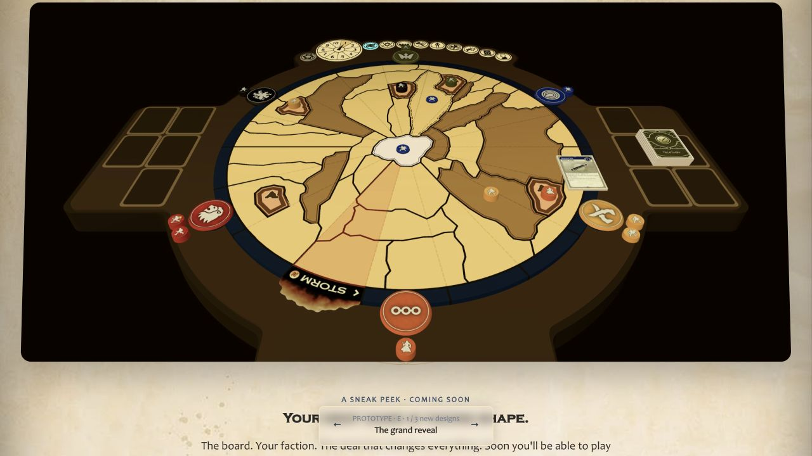 | 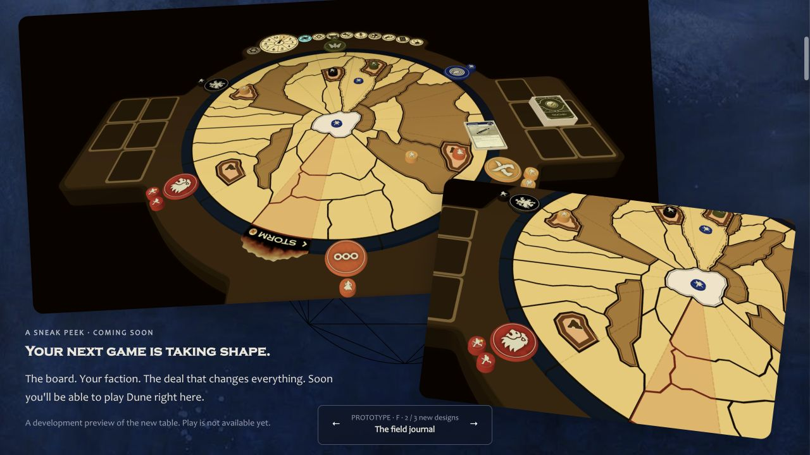 | 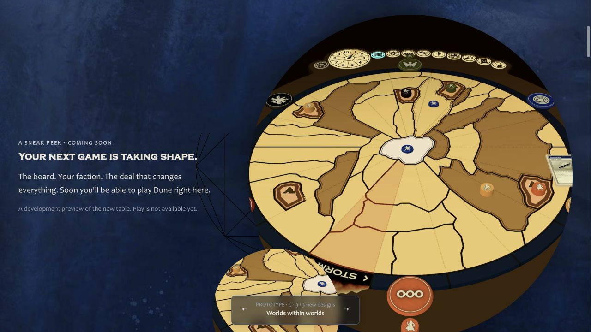 |
| [Complete E page](proof/round-two/E-desktop.jpg) | [Complete F page](proof/round-two/F-desktop.jpg) | [Complete G page](proof/round-two/G-desktop.jpg) |
| 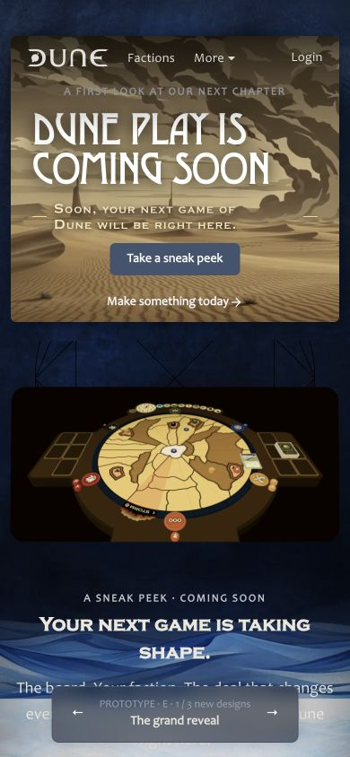 | 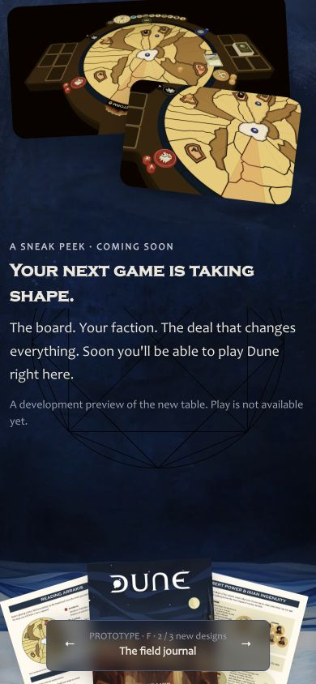 | 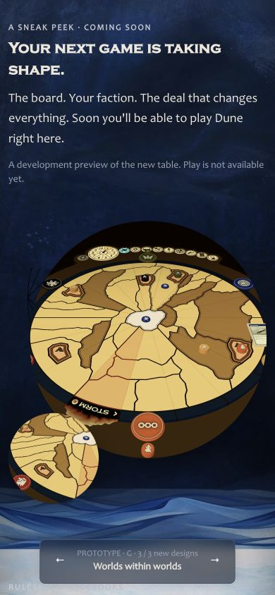 |

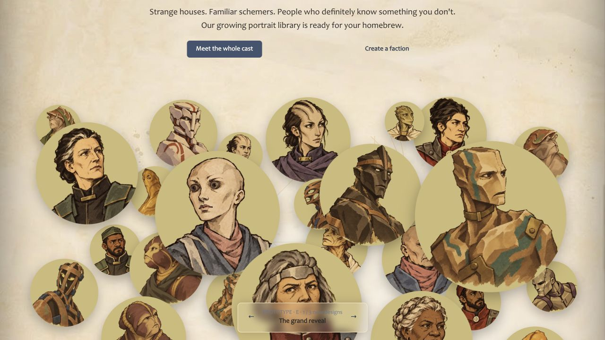
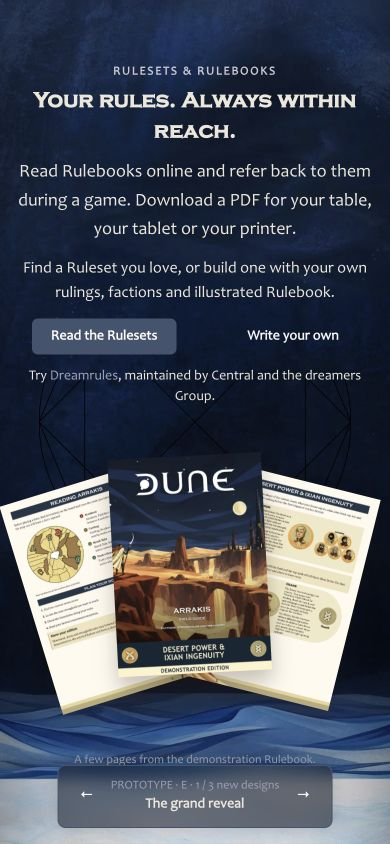
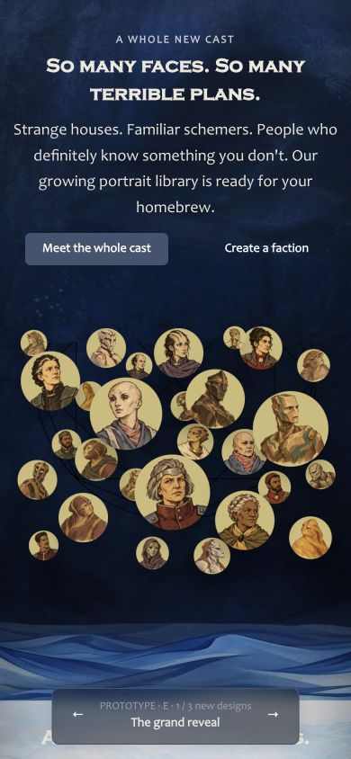
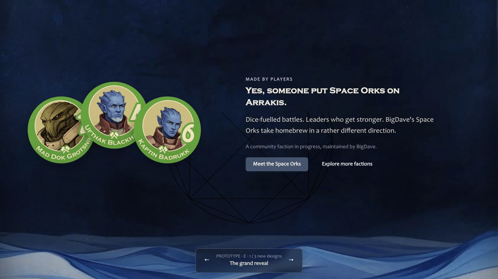
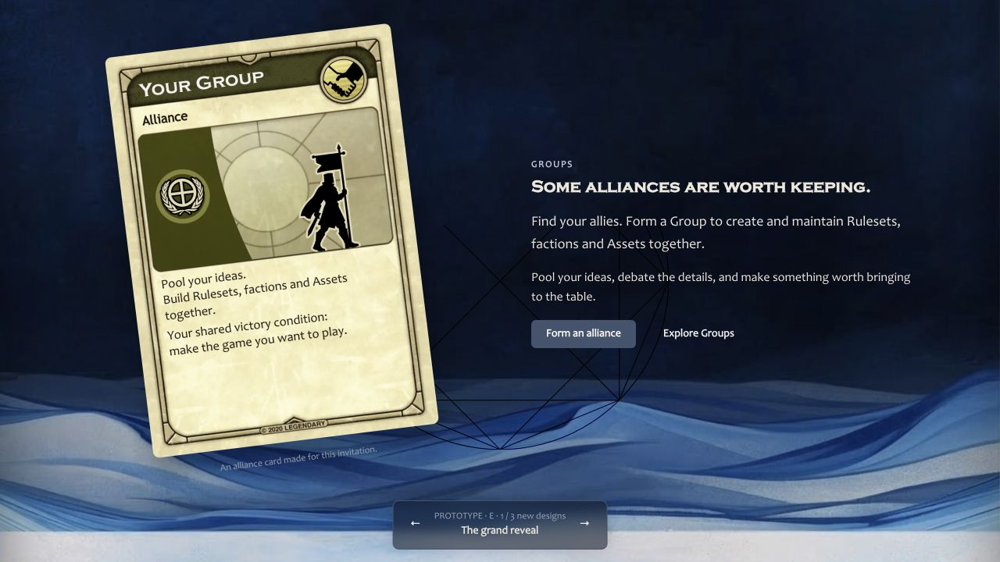

## E refinement

E now uses a transparent 3000 by 1420 board capture with a CSS mask fading its bottom edge. The capture comes directly from the existing Playing fixture renderer with alpha enabled and its scene background omitted. The temporary capture control and renderer changes were removed after capture; production Play code is unchanged. The PNG contains real alpha, so dark board details retain their original opacity. The earlier JPEGs remain available for F and G.

Rulebook pages, portrait discs, troop discs, cards and the alliance example share a two-part drop shadow. Ork discs clip their artwork inside the element casting the shadow, so the shadow is no longer clipped. Hover retains each piece's stacking order. E ends after the Group alliance section; "More ideas to borrow" is removed from E.

Typecheck and focused lint passed. Browser checks confirmed the removed heading, the gradient mask, shadows and unchanged computed stacking before and during hover. E fits a 390-pixel phone viewport without horizontal overflow. Temporary viewport and hover overrides were cleared.

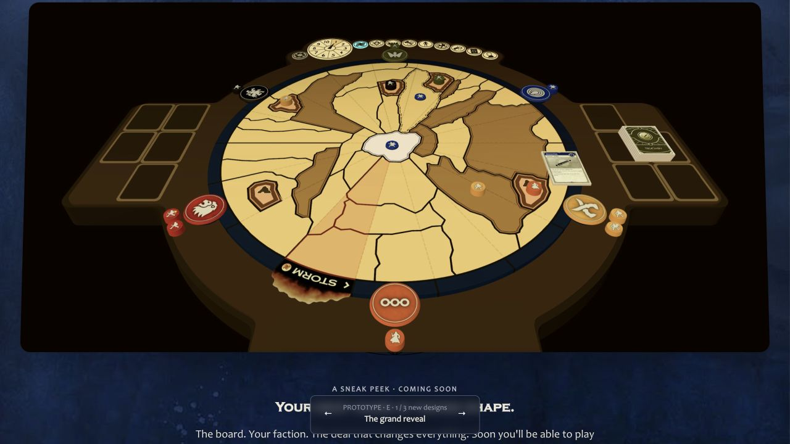
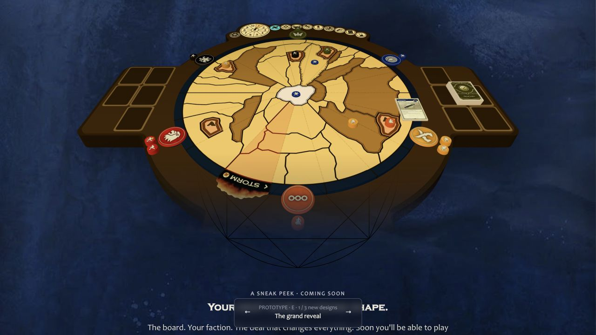
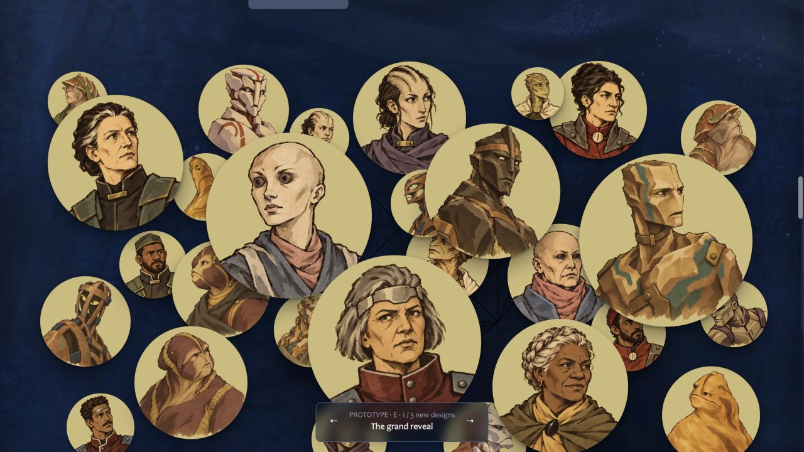
