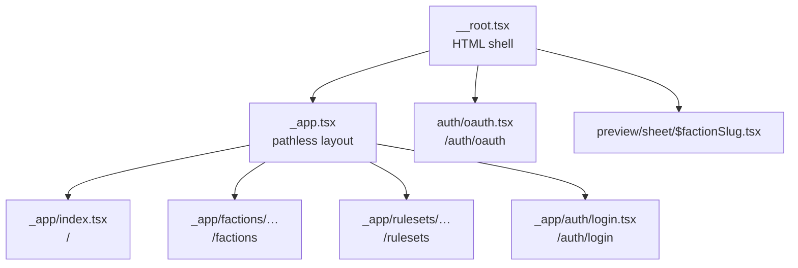

# Routing

## Route structure



Routes live in `src/app/routes/`. File structure maps to URLs with one exception that governs
nearly every file: `_app` is a **pathless layout route** and contributes no URL segment.

## The `_app` layout route

[`src/app/routes/_app/route.tsx`](../src/app/routes/_app/route.tsx) wraps every visual route in
`ApplicationChrome`, the Mantine provider plus `AppRoot`, which owns the persistent header, footer,
and document-level scroll effects. It also owns the 404: `notFoundComponent: AppNotFound`.

Two kinds of route live *outside* `_app`, deliberately, because they must not carry application
chrome: `auth/oauth.tsx` (a non-visual hand-off) and `preview/sheet/$factionSlug.tsx` (a
document-rendering target).

**Every terminal visual route must render `PageLayout`** from
[`@ui/layout/PageLayout`](../src/app/ui/layout/PageLayout.tsx), supplying the slots that page needs:
`content`, usually a `header` (omit it for a compact page), and an optional `toolbar`. Nested parent
routes stay outlet-only. This is enforced, since
[`PageLayout.architecture.test.ts`](../src/app/ui/layout/PageLayout.architecture.test.ts) scans the
route files and fails on a terminal route that omits it. The reasoning is [*Terminal routes mount
PageLayout*](technical/ui-design-decisions.md#terminal-routes-mount-pagelayout).

## File-based routing

**Location**: `src/app/routes/`, for example `_app/index.tsx` → `/`, `_app/auth/login.route.tsx` →
`/auth/login`, `auth/oauth.route.tsx` → `/auth/oauth`. Route tree auto-generates:
[`src/app/routeTree.gen.ts`](../src/app/routeTree.gen.ts)

### Which files are routes

**A route file is `index.tsx`, or its last dot-segment is `route`.** `create.route.tsx` and
`edit/route.tsx` are routes; nothing else in a route folder can be a URL. The generator's
`routeFileIgnorePattern` in [`vite.config.ts`](../vite.config.ts) skips every other source file,
so the modules a page keeps beside itself carry plain names:
[`catalogue.ts`](../src/app/routes/_app/factions/catalogue.ts), `catalogue.test.ts`,
`faqEditingSession.ts`, `useFactionSheetPostMessage.ts`. A page's composition belongs in its route
file, and a piece with one caller belongs beside that caller, which is why route folders hold
helpers, hooks, organs, tests and stories as well as routes. A route file that forgets its suffix is
skipped silently rather than warned about, and shows up as a missing page on first navigation.

**A route owns a folder only when it has something to put there.** A route with organs or child
routes sits inside its folder as `route.tsx`, beside them, as
[`edit/route.tsx`](../src/app/routes/_app/rulesets/$rulesetSlug/rulebooks/$rulebookSlug/edit/route.tsx)
does with the rulebook editor's organs. A route with neither is a flat `create.route.tsx`. A folder
of child routes needs no pass-through parent: `groups/$groupSlug/` holds `index.tsx` and
`edit.route.tsx` with nothing above them, and the router nests them under `/groups/$groupSlug`
anyway. A stylesheet takes its route's stem and sits beside it: `index.module.css`,
`route.module.css`, `login.module.css`.

The generated route tree is the one authority on which files are routes. Anything that needs the
list, such as the PageLayout architecture test, reads the tree's imports rather than restating the
naming rule.

## Route pattern

```typescript
import { createFileRoute } from '@tanstack/react-router';

export const Route = createFileRoute('/_app/path')({
  component: Component,
  loader: loadSomething, // one Convex read for first paint
});

function Component() {
  const loaderData = Route.useLoaderData();
  const page = useSomething({ initialData: loaderData });
  // render through PageLayout
}
```

The loader-then-subscribe handoff is covered in [State Management](./state-management.md); the
one-query-per-route rule is [*One Convex query per route*](technical/ui-design-decisions.md#one-convex-query-per-route).

**Example**: [`src/app/routes/_app/index.tsx`](../src/app/routes/_app/index.tsx)

## Root route

**File**: [`src/app/routes/__root.tsx`](../src/app/routes/__root.tsx)

- Provides the HTML shell (`<html>`, `<head>`, `<body>`) via `shellComponent: RootDocument`
- Imports the global stylesheets, including the document background in `src/app/styles/page.css`
- Carries the router devtools wiring commented out, to be switched on while debugging

404s and application chrome belong to `_app`, not here.

Access loader data in a component: `Route.useLoaderData()`
