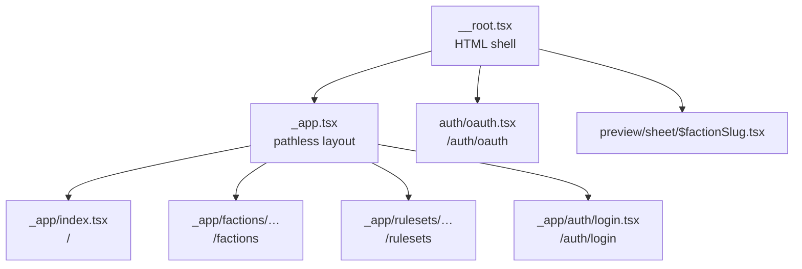

# Routing

## Route Structure



Routes live in `src/app/routes/`. File structure maps to URLs with one exception that governs
nearly every file: `_app` is a **pathless layout route** and contributes no URL segment.

## The `_app` layout route

[`src/app/routes/_app.tsx`](../src/app/routes/_app.tsx) wraps every visual route in
`ApplicationChrome` — the Mantine provider plus `AppRoot`, which owns the persistent header, footer,
and document-level scroll effects. It also owns the 404: `notFoundComponent: AppNotFound`.

Two kinds of route live *outside* `_app`, deliberately, because they must not carry application
chrome: `auth/oauth.tsx` (a non-visual hand-off) and `preview/sheet/$factionSlug.tsx` (a
document-rendering target).

**Every terminal visual route must render `PageLayout`** from
[`@ui/layout/PageLayout`](../src/app/ui/layout/PageLayout.tsx), supplying its
`header`, optional `toolbar`, and content together. Nested parent routes stay outlet-only. This is
enforced — [`PageLayout.architecture.test.ts`](../src/app/ui/layout/PageLayout.architecture.test.ts)
scans the route files and fails on a terminal route that omits it. The reasoning is DD-014 in
[`technical/ui-design-decisions.md`](technical/ui-design-decisions.md).

## File-Based Routing

**Location**: `src/app/routes/` — e.g. `_app/index.tsx` → `/`, `_app/auth/login.tsx` →
`/auth/login`, `auth/oauth.tsx` → `/auth/oauth`. Route tree auto-generates:
[`src/app/routeTree.gen.ts`](../src/app/routeTree.gen.ts)

## Route Pattern

```typescript
import { createFileRoute } from '@tanstack/react-router';

export const Route = createFileRoute('/_app/path')({
  component: Component,
  loader: loadSomething, // one Convex read for first paint
});

function Component() {
  const loaderData = Route.useLoaderData();
  const page = useSomething({ initialData: loaderData });
  // render through PageLayout
}
```

The loader-then-subscribe handoff is covered in [State Management](./state-management.md); the
one-query-per-route rule is DD-013.

**Example**: [`src/app/routes/_app/index.tsx`](../src/app/routes/_app/index.tsx)

## Root Route

**File**: [`src/app/routes/__root.tsx`](../src/app/routes/__root.tsx)

- Provides the HTML shell (`<html>`, `<head>`, `<body>`) via `shellComponent: RootDocument`
- Imports the global stylesheets, including the document background in `src/app/styles/page.css`
- Carries the router devtools wiring commented out, to be switched on while debugging

404s and application chrome belong to `_app`, not here.

Access loader data in a component: `Route.useLoaderData()`
