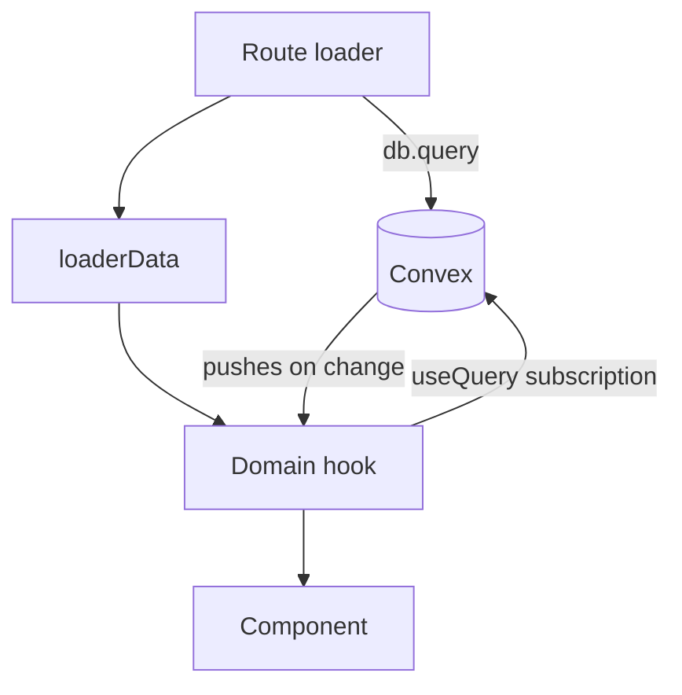

# State Management

There is no client cache to manage. Convex holds a live subscription per query and pushes new
results when the underlying documents change, so the patterns a cache needs — query keys, manual
invalidation, writing a mutation result back into a cache — do not exist in this codebase.

What replaces them is one seam, [`src/app/db/core/live.ts`](../src/app/db/core/live.ts), and one
convention: a route loads data once for first paint, then subscribes for the rest of the screen's
life.

## The two paths to the same data



- **Loader** — [`db.query`](../src/app/db/core/index.ts) from `src/app/db/core/index.ts`, awaited
  before the route renders. During TanStack Start prerendering it swaps to a `ConvexHttpClient`,
  since there is no session or socket then.
- **Subscription** — `useQuery` from `convex/react` inside the domain hook, handed the loader's
  result as `initialData` so the first render has data and later renders are live.

## Domain hook shape

Every read hook in `src/app/db/<domain>.ts` is the same three lines: subscribe, normalize, wrap.

```typescript
export function useFaction(slug: string, options?: { initialData?: FactionDetailPageData }) {
  const liveData = useQuery(api.factions.getBySlug, { slug });
  const normalized = liveData ? toFactionDetailPageData(liveData) : undefined;
  return toLiveQueryResult(normalized, true, () => options?.initialData ?? undefined);
}
```

`toLiveQueryResult` exists to keep call sites uniform: it returns
`{ data, isPending, isLoading, isError, error }`, falling back to `initialData` while the
subscription is still undefined. `isError` is always `false` — a failed Convex subscription throws
to the route's error boundary rather than resolving into a result object.

**Example**: [`src/app/db/factions.ts`](../src/app/db/factions.ts)

## Mutations

`useLiveMutation` wraps Convex's `useMutation` and adds the pending/error/data state and the
`onSuccess` / `onError` / `onSettled` callbacks that call sites want. It deliberately mimics the
shape of a mutation hook you may recognize from a cache library, but **no cache work happens in it,
and none is needed** — every subscription reading the changed documents is re-pushed by Convex.

So a mutation's `onSuccess` is for navigation, notification, and form reset. Writing a result into
a cache, invalidating a sibling list, or refetching after a write are all mistakes here: they are
either no-ops or a second read of data that is already arriving.

**Example**: `useCreateFaction`, `useUpdateFaction`, `useDeleteFaction` in
[`src/app/db/factions.ts`](../src/app/db/factions.ts)

## Rules

- One Convex page query per route, plus `useCurrentProfile` when the UI is auth-aware — see
  [*One Convex query per route*](technical/ui-design-decisions.md#one-convex-query-per-route). Derive
  what the screen needs inside that query rather than adding child subscriptions.
- Pass loader data down as `initialData`; do not re-query in a child for data the page already has.
- Client-side parsing is for UX feedback only. The authoritative parse happens in the Convex
  handler — see [`data-layer.md`](data-layer.md).
