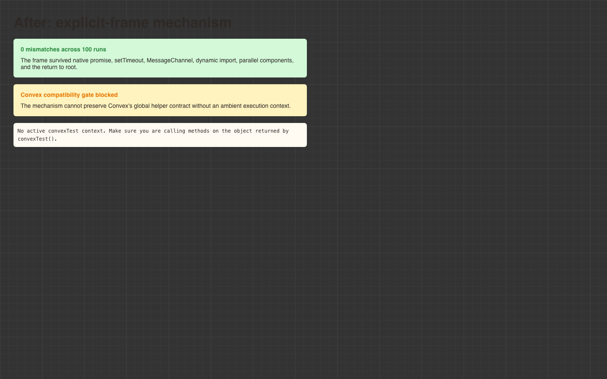

# Browser Convex context conformance

## Result

The explicit-frame approach cannot preserve the current Convex function contract without an ambient execution-context primitive or a coordinated Convex SDK fork. The browser-local database foundation should not proceed on this strategy.

The mechanism itself works. An immutable frame passed as an ordinary argument survived 100 overlapping runs through native promises, `setTimeout`, `MessageChannel`, dynamic import, parallel component branches, component authentication removal, and the return to the root frame. It recorded zero mismatches in Storybook development and in the emitted static build.

The Convex compatibility gate fails before the remaining database conformance cases can provide useful evidence. `createFunctionHandle(reference)` has no context parameter. It calls `performAsyncSyscall`, which reaches the process-global `Convex.asyncSyscall`. `convex-test` makes that global safe in Node by selecting the active world through `AsyncLocalStorage`. Removing the ambient store leaves no information with which the helper can select a world or component.

The same boundary applies to the database, auth, storage, scheduler, and nested-function objects that Convex creates for registered handlers. Those services call global syscalls from closures made inside Convex's registration implementation. Calling the registered `_handler` directly avoids the registration wrapper, but a compatible browser fork would then need to construct every service itself and retain argument validation, return validation, transaction limits, pending commit values, error conversion, HTTP behavior, component resolution, and future Convex additions.

This is not a `convex-test` patch. It is a second browser backend runtime maintained across both `convex-test` and Convex. A source-compatible global helper cannot become explicit because its public call contains no frame to pass. A compiler transform or a future platform `AsyncContext` could supply that missing information, but both were rejected by the strategy research for today's static browser target.

The acceptance gate in #748 says to reject the fork if a required global helper cannot be made explicit without temporary ambient assignment. That gate is met.

## Reusable browser characterization

The retained stories are under `Pages/Create ruleset`:

- `Ambient Context Before` runs the exact single-slot adapter from the spike. Three of five checkpoints resume with a sibling, caller, or child frame.
- `Explicit Frame Attempt` runs 100 immutable-frame interleavings and records zero mechanism mismatches. It then calls the real Convex `createFunctionHandle` entry point and records `No active convexTest context` as the compatibility blocker.

Both stories have play tests. The blocked result is asserted as a characterization, so a future strategy can replace the expected blocker with a passing contract without losing the reproduction.

## Receipts

Development browser tests:

```sh
bun run storybook:test -- --testNamePattern='Ambient Context Before|Explicit Frame Attempt'
```

Result:

```text
Test Files  1 passed | 99 skipped (100)
Tests       2 passed | 393 skipped (395)
```

Static build:

```sh
bun run build-storybook -- --output-dir /tmp/dunezone-storybook-744
```

Result: Storybook completed the production build. The two emitted stories then passed in headless Chromium when served below `/catalogue/`. The iframe, worker, worker chunks, dynamic import, and result UI all loaded from the static output. No hosted Convex deployment was contacted.

Visual receipts are stored outside the repository with the other Dune Zone captures:

```text
/Users/me/Projects/Dune/dunezone-screenshots/issue-744/before-ambient-context.png
/Users/me/Projects/Dune/dunezone-screenshots/issue-744/after-explicit-frame.png
```

The branch keeps copies so the ticket can display the evidence.

### Before: ambient context


### After: explicit-frame attempt



## Stop point

The prototype did not port the transaction, scheduler, HTTP, and Aggregate suites to the explicit runner. Passing those cases would require first replacing the Convex service objects that depend on the failed global boundary. Doing that work after the gate failed would measure the size of a private Convex runtime, not test whether the selected strategy is a small reliable foundation.

The practical fallback remains compact, schema-validated, deterministic page scenarios. That path keeps page stories local and resettable without publishing a second backend implementation or adding large hand-written response fixtures.
