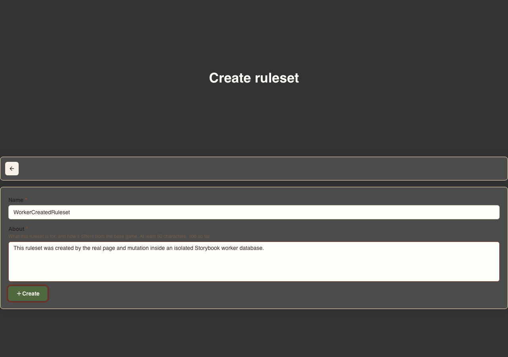
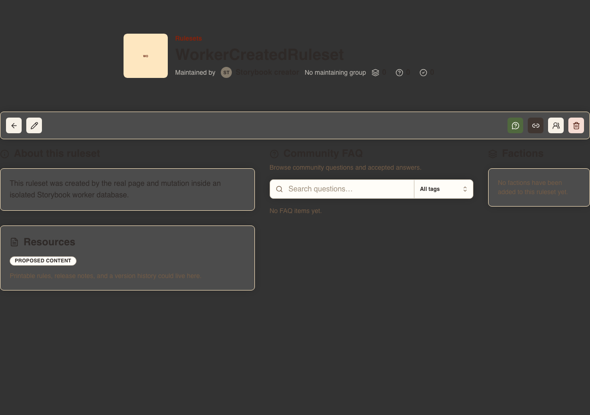
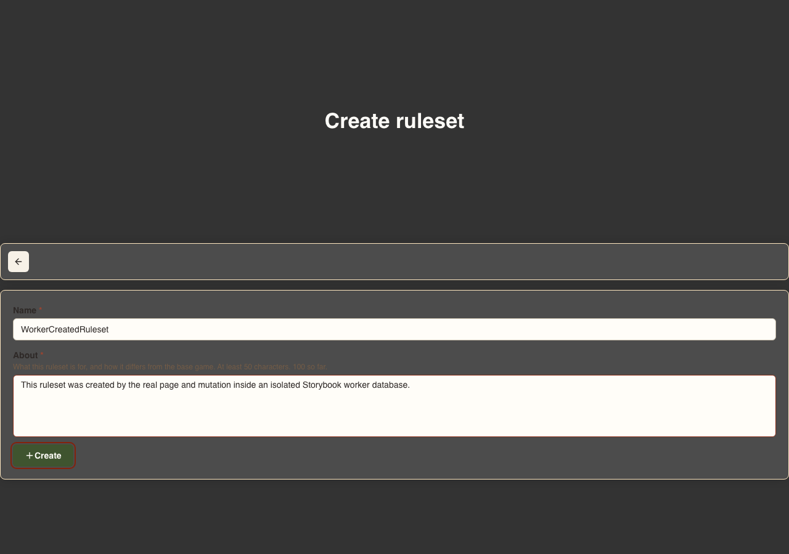
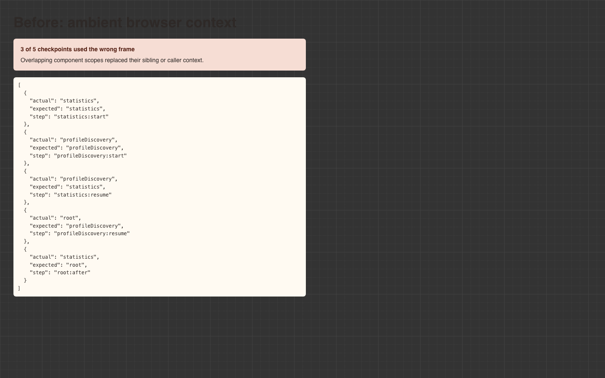
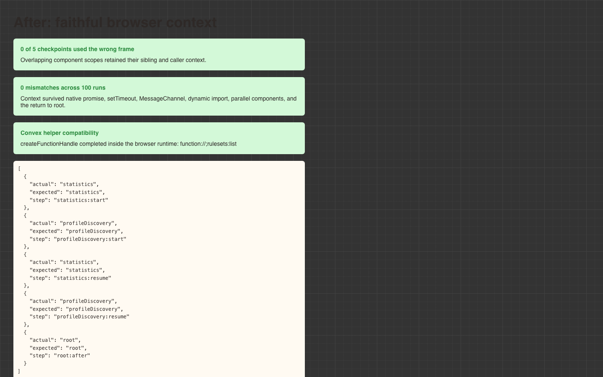

# Browser Convex runtime verdict

## Result

The browser-local Convex plan is feasible enough to continue to the foundation ticket.

The prototype runs a real application route through its production Convex query and mutation handlers in an isolated Storybook Web Worker. It works in Storybook development and in a served static build below `/catalogue/`. Authentication, nested component calls, triggers, scheduling, rollback, query refresh, worker replacement, and Convex global helpers all passed the representative conformance suite. The static story also completed with the browser offline.

This is not a claim that `convex-test` supports browsers by itself. The working runtime pins its dependencies, loads Zone.js in the worker, and lowers every async function and `await` in the worker closure before execution. Build guards reject any module or emitted worker chunk that retains native async syntax. That combination fixes the ambient execution-context failure found in tickets #744 and #748.

Proceed to #742 with the guardrails in this report. Stop the implementation if any page-reachable module bypasses the transform or requires unsupported Convex behavior that cannot fail clearly.

## Why the earlier blocker is cleared

Zone.js can preserve context across Promise callbacks, but native `await` does not have to pass through patched Promise methods. That is the failure recorded by [`convex-test` issue #122](https://github.com/get-convex/convex-test/issues/122). The current upstream isolation work also remains based on `AsyncLocalStorage`; [`convex-test` pull request #83](https://github.com/get-convex/convex-test/pull/83) does not add a browser execution context.

The prototype combines two mechanisms:

1. Zone.js supplies the worker's `AsyncLocalStorage` implementation.
2. Vite's Oxc transform lowers native async functions to generator and Promise continuations before the worker executes them.

The transform covers the worker entry, the repository's Convex modules, and the raw dependencies that form the worker closure. It runs during development and the static worker build. An AST check rejects transformed modules containing an `AwaitExpression` or an async function. A bundle check applies the same rule to every emitted worker chunk.

This makes the workaround testable rather than assumed. The browser conformance story now reports:

- 0 of 5 wrong ambient frames across overlapping component scopes;
- 0 mismatches across 100 interleaving runs;
- a successful `createFunctionHandle` call inside a real `convex-test` execution context;
- a successful return from an Aggregate component path to the root `rulesets:list` module.

## Alternatives checked

- The prototype uses the latest stable releases available during the spike: `convex` 1.45.0 and `convex-test` 0.0.56. Both are pinned exactly.
- No published prerelease or current upstream change supplies a browser `AsyncLocalStorage` or explicit Convex execution frame. Upstream pull request #83 strengthens global isolation on Node and does not cross the browser boundary.
- The explicit-frame runner from #748 remains sound for code that accepts a frame, but Convex global helpers and service objects do not expose one. Rebuilding those services would create a second private Convex runtime.
- A pinned `convex-test` fork is no longer required for this proof. The smaller adapter is the Zone-backed `AsyncLocalStorage` plus the fail-closed async transform. A fork remains the fallback if an upstream module cannot pass through that transform.

## Application reachability inventory

The current browser application references 62 public Convex functions. They are queries and mutations; no page path currently invokes a public action directly.

| Module | References |
| --- | ---: |
| `accountDeletion` | 3 |
| `assets` | 10 |
| `factions` | 9 |
| `faq` | 8 |
| `groups` | 4 |
| `homepage` | 1 |
| `members` | 5 |
| `migrations` | 2 |
| `profiles` | 6 |
| `publicationAdmin` | 2 |
| `rulesets` | 12 |

The runtime can register and execute those function modules without replacing handlers with response fixtures. This spike does not claim that it has exercised every business branch of all 62 functions. The Rulesets page is the representative hard path. Later page stories must exercise the production handlers used by each page, while direct Convex tests retain exhaustive unhappy-path coverage.

## Proven matrix

| Case | Development | Static build |
| --- | --- | --- |
| Render the real Rulesets create route | Passed | Passed |
| Run the authenticated production create mutation | Passed | Passed |
| Run Aggregate triggers and read the committed row through `detailPageBySlug` | Passed | Passed |
| Navigate to the real detail route and refresh its active query | Passed | Passed |
| Run the page-reachable Migrations query and mutation through its component | Passed | Passed |
| Replace the worker, return to the page, and create again | Passed | Passed |
| Keep adjacent signed-in and signed-out identities separate | Passed | Passed |
| Preserve nested component paths and return to the root module | Passed | Passed |
| Execute scheduled work and preserve rollback | Passed | Passed |
| Complete 20 clean worker replacements | Passed | Passed |
| Block external fetch while serving local Convex HTTP handling | Passed | Passed |
| Run `createFunctionHandle` in the browser execution context | Passed | Passed |
| Serve Storybook below `/catalogue/` | Not applicable | Passed |
| Complete the page mutation while the browser is offline | Not applicable | Passed |

Every active story owns one worker. Calls within that worker are serialized. Different stories can still execute in parallel because they do not share a database or ambient context.

## Page proof

The proof pauses the existing `Create Reset And Create Again` interaction at its three observable states. The route, form submission, mutation, navigation, committed query result, worker replacement, and second form render are the same code exercised by the automated story.

### Before the mutation



### After the mutation and query refresh



### After database reset



## Context proof

The baseline is the retained failure from #744. It used the previous ambient-context shim and lost three of five frames under overlapping component execution.



The current static build keeps every frame, passes the 100-run interleaving check, and completes the Convex helper call.



## Compromises and fragilities

### High-impact obligations

- **Dependency and optimizer coupling.** The prototype pins `convex` 1.45.0, `convex-test` 0.0.56, and `zone.js` 0.16.2. Vite optimizer exclusions and one nested CommonJS inclusion are explicit. Any upgrade can change the worker closure or bypass the transform, so the conformance suite and parser guard must gate upgrades.
- **Complete async lowering is mandatory.** Zone.js alone is incorrect for this use. The build must fail if native async syntax reaches the worker. A future dependency that generates code at runtime would need separate investigation.
- **Manual server-module registration remains.** `convex-test` needs the relevant Convex modules and component modules supplied to its test world. The foundation should centralize this registration and fail on an unknown function or component path.
- **This is Convex handler fidelity, not hosted transport fidelity.** Stories execute the real query and mutation functions, schema, auth identity, triggers, scheduler, and database transactions. They do not exercise Convex WebSockets, a deployed backend, production identity providers, or hosted deployment configuration.

### Medium-impact obligations

- **Query refresh is coarse.** After a mutation, the prototype reruns active queries. It does not reproduce Convex's dependency-tracked subscription protocol. This is sufficient for page state after a mutation, but it cannot prove transport-level subscription behavior.
- **Component coverage grows on demand.** Aggregate and Migrations are registered and proven. Identity-based authentication is proven without registering the Auth provider component because no current page handler calls it. Full provider flows remain out of scope. A page that reaches another component must add it to the centralized registration and a conformance case before its story is accepted.
- **Synthetic state still exists.** The runtime removes fixtures of intermediate query responses. It does not remove seed data. The seed contract from #743 remains necessary so stories describe compact domain state rather than large serialized databases.
- **Worker startup has a cost.** The emitted worker is about 128 kB uncompressed, and every active story owns an instance. This is acceptable for the coverage and isolation goal. Speed is not a success criterion for this map.

### Low-impact obligations

- **Static assets remain separate from database state.** The hosted Storybook can copy the canonical shared image and font assets into its artifact. It does not need another mutable asset database.
- **Source is public, but publication checks still matter.** The repository is open source. The security concern is accidental publication of credentials, a hosted Convex URL, or production data. The accepted artifact scan, CSP, isolated subdomain, offline worker, and `connect-src 'none'` policy remain appropriate.

The final static artifact scan found no `convex.cloud` or `convex.site` URL, known deployment identifier, `VITE_CONVEX_URL`, or deploy-key marker. It contains the inert `storybook.invalid` origins used by local storage and HTTP emulation. The `AUTH_SECRET` identifier remains in bundled Auth source, but no value is present and the worker environment is empty.

## Weighted decision

| Consideration | Weight | Assessment |
| --- | ---: | --- |
| Real page, query, and mutation coverage in one rerunnable browser scenario | Very high | Strong benefit |
| Page development from deterministic database and URL state | Very high | Strong benefit |
| Removal of large response fixtures and intermediate-shape mocks | High | Strong benefit |
| Story-level isolation and reset | High | Strong benefit |
| Visible evidence for page changes | High | Strong benefit |
| Replacement of direct query failure tests | None | Not intended; direct tests remain better for unhappy paths |
| Maintenance of the async transform and optimizer boundary | High | Material cost, contained by fail-closed guards |
| Divergence from hosted Convex transport | Medium | Accepted limit, stated explicitly |
| Runtime and build speed | Low for this map | Deferred until coverage is established |

The benefits apply to every page added later. The largest cost is concentrated in one foundation boundary rather than repeated per-page adapters. That trade is favorable only while the foundation stays centralized, guarded, and honest about transport-level limits.

## Foundation handoff

Ticket #742 should:

1. Move the worker, async transform, protocol, and Storybook hooks behind one shared page-story doorway.
2. Retain the AST and emitted-bundle async checks in development, tests, and static builds.
3. Pin the proven package versions and make dependency upgrades run the full conformance suite.
4. Centralize Convex module and component registration. Unknown paths must fail with the requested path in the error.
5. Define a small scenario membrane for synthetic database state, identity, path parameters, and search parameters. Do not add page-specific response adapters.
6. Preserve one worker per active story, serialized calls per worker, deterministic replacement, and parallel isolation between stories.
7. Run the same conformance story in the browser test project and against a served static artifact below a non-root path.
8. Add the accepted publication scan, CSP, isolated-host assumptions, and network denial before public hosting.

The separate page phase remains blocked until that foundation is merged and green. Each page then gets only its meaningfully distinct rendered versions, including URL parameter cases when they change the page. Journeys and full parameter matrices do not belong in this layer, and end-to-end tests remain unchanged during this map.

## Reproduction

```sh
bun run typecheck
bun run test
bun run storybook:test
bun run storybook:test -- --testNamePattern='Create Reset And Create Again|Identities And Network Stay Isolated|Twenty Clean Worker Resets|Zone Context Conformance'
bun run build-storybook
VITE_CONVEX_URL=https://storybook.invalid bun run publisher:release:verify
```

The final branch passed 749 unit tests and 394 browser stories. The static verification served `storybook-static` below `/catalogue/` and passed all four conformance stories. It then loaded the page story, switched the browser offline, replaced its worker, and created `OfflineCreatedRuleset`. No hosted Convex deployment or shared development database was contacted.
