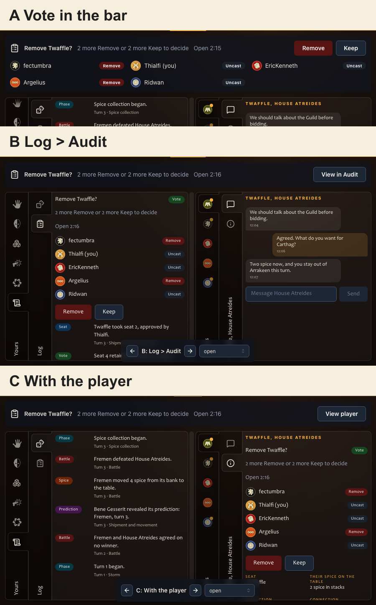

# Removal voting placement

[Prototype removal voting in the controls panel](https://github.com/ndelangen/dunezone/issues/1201) answers the placement question left open in [Design the combined Play journey and layout](https://github.com/ndelangen/dunezone/issues/1016#issuecomment-5640189532). No variant is accepted yet.

Run `bun run app:dev` from `norbert/1145-drafting-panel-prototype`. Open `/play/demo?variant=play&vote=A&scenario=vote-open&seats=6`. The floating switcher cycles A, B and C, also using the arrow keys outside controls.

| Variant | Arrangement |
| --- | --- |
| A | The important-decision bar contains the ballots and voting buttons. Both tab panes stay available for other work. |
| B | A compact bar opens Log > Audit. The active vote appears above participation history. |
| C | A compact bar opens the target player's Public state tab. The active vote appears above their other public information. |

Scenarios are `vote-open`, `vote-multiple`, `vote-target`, `vote-spectator` and `vote-resolved`. Players can change or withdraw a ballot. The target and spectator see public ballots without voting controls. The multiple-vote fixture keeps each target's ballots separately. Closed ballots cannot be edited. The elapsed counter counts upward and never expires a vote.

The [participation contract](https://github.com/ndelangen/dunezone/issues/1011#issuecomment-5574395620) owns thresholds, membership, authority and retained history. This fixture compares placement using six snapshotted players. It does not implement hosted membership changes or removal. The target and spectator scenarios change ballot authority only; the surrounding demo inventories and conversation remain the ordinary fixture.

## Parts and ownership

| Part | Existing component or owner | Decision represented |
| --- | --- | --- |
| Bar pane | Kit Surface, borderless | Important decisions occupy a bar above the controls panel. |
| Ballot controls | Mantine Button, Group | Named Remove and Keep choices, editable until the result, with Withdraw returning to uncast. |
| Ballot status | Mantine Badge and Text | Named public ballots distinguish Remove, Keep and Uncast. |
| Faction markers | Existing FactionToken with captured renderer assets | The same real faction faces used throughout the prototype. |
| Vote context | TopicIcon audit mapping | Participation uses the existing Audit topic. |
| Panel placement | Existing PlayPanel and NestedTabs | Retain the accepted dual tabs and Game/Audit split. |
| Pane rhythm | Mantine Stack and Group; route-owned placement CSS | One inset in each pane. No nested surface and no new border. |
| Comparison navigation | Mantine ActionIcon and Select | URL-owned variant and scenario controls, outside the product UI. |

`RemovalVotePrototype.tsx` is a route organ that composes those parts and holds the temporary ballot state. `voting.ts` owns the URL fixture vocabulary shared by the route's search parser and its prototype organs. Nothing is proposed for the kit yet.

The branch stays unmerged. There are no database, production or deployment changes. After a choice, tag rejected variants, retain the chosen arrangement under a plain name and record the accepted parts here before resolving the ticket.
