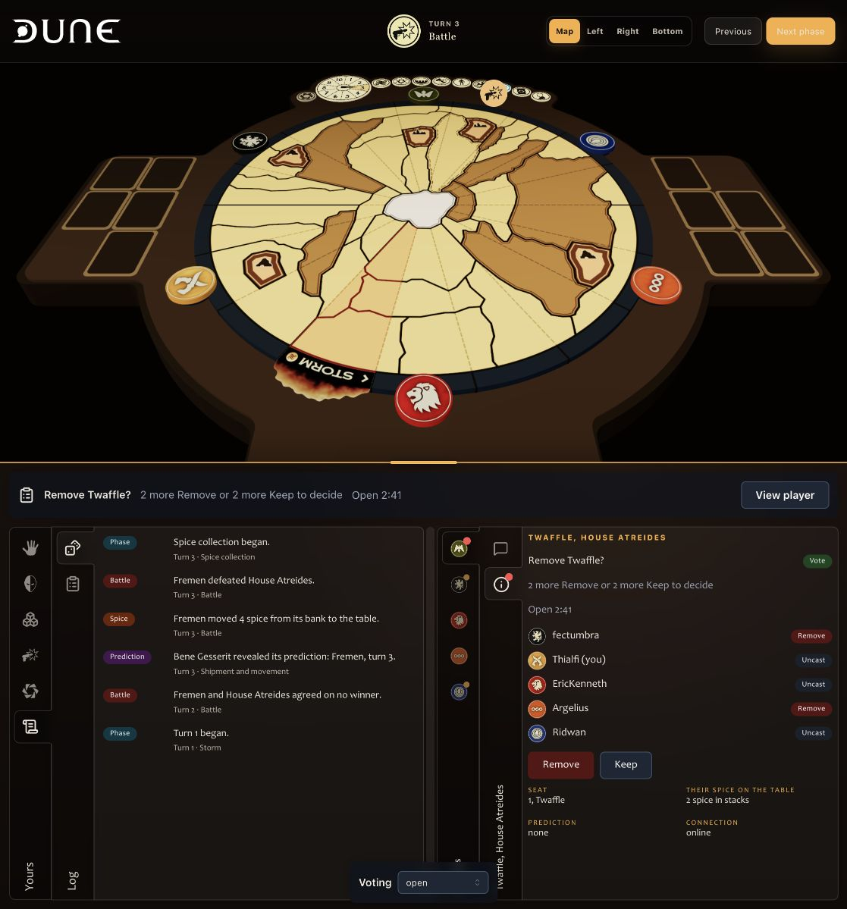

# Removal voting with the player

Norbert [accepted C and a bright red activity indicator during an open vote](https://github.com/ndelangen/dunezone/issues/1016#issuecomment-5688817597). [Prototype removal voting in the controls panel](https://github.com/ndelangen/dunezone/issues/1201) keeps that choice under the plain name `voting`.

Run `bun run app:dev` from `norbert/1145-drafting-panel-prototype`. Open `/play/demo?variant=play&vote=voting&scenario=vote-open&seats=6`. The small development-only switcher selects the fixture state.

The compact important-decision bar opens the target player's Public state tab. The active vote appears above their other public information. Named public ballots and Remove, Keep and Withdraw stay with that player. Log retains its accepted Game/Audit layout and participation history.

Open votes show a bright red activity mark on the affected player's tab and Public state tab. The mark takes priority over unread activity, survives reading the conversation and ends when the vote closes. Each target in a concurrent vote has its own mark. Selecting a marked player opens Public state; Conversation remains available in the second tab level.

Scenarios are `vote-open`, `vote-deciding`, `vote-multiple`, `vote-target`, `vote-spectator` and `vote-resolved`. In `vote-deciding`, Keep closes the vote so the red mark can be checked through the actual transition. Players can change or withdraw an open ballot. The target and spectator see public ballots without voting controls. The multiple-vote fixture keeps each target's ballots separately. Closed ballots cannot be edited. The elapsed counter counts upward and never expires a vote.

The [participation contract](https://github.com/ndelangen/dunezone/issues/1011#issuecomment-5574395620) owns thresholds, membership, authority and retained history. This fixture uses six snapshotted players. It does not implement hosted membership changes or removal. The target and spectator scenarios change ballot authority only; surrounding inventories and conversations remain the ordinary demo fixture.

## Parts and ownership

| Part | Existing component or owner | Decision represented |
| --- | --- | --- |
| Bar pane | Kit Surface, borderless | Important decisions occupy a compact bar above the controls panel. |
| Ballot controls | Mantine Button and Group | Named Remove and Keep choices, editable until the result, with Withdraw returning to uncast. |
| Ballot status | Mantine Badge and Text | Named public ballots distinguish Remove, Keep and Uncast. |
| Activity mark | Mantine Indicator, the theme's red palette | An open removal vote is bright red and takes priority over unread activity. The indicator is composed into the tab icon slot. |
| Faction markers | Existing FactionToken with captured renderer assets | The same real faction faces used throughout the prototype. |
| Vote context | TopicIcon audit and publicState mappings | The bar announces participation activity; the player's existing information tab holds its detail. |
| Panel placement | Existing PlayPanel and NestedTabs | The accepted dual tabs remain; votes live with the target player. |
| Pane rhythm | Mantine Stack and Group; route-owned placement CSS | One inset in each pane. No nested surface and no new border. |
| Scenario navigation | Mantine Select | URL-owned review states outside the product UI. |

`RemovalVotePrototype.tsx` is a route organ that composes those parts and holds temporary ballot state. `voting.ts` owns the URL fixture vocabulary shared by the route's search parser and prototype organs. No kit component or kit API change is proposed.

## Archive

`prototype/1201-A-rejected` and `prototype/1201-B-rejected` both point to `24b57f93b1f017f40d00b6df921eca102b981fd1`, preserving the comparison, its screenshot and the rejected placements. The live code contains only the accepted player placement. A, B and C are no longer live URL names.

The branch stays unmerged. There are no database, production or deployment changes.
